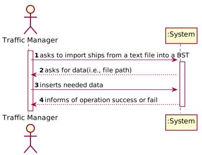
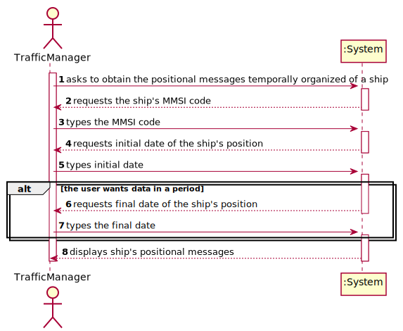
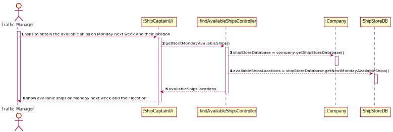
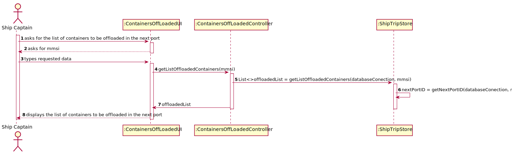
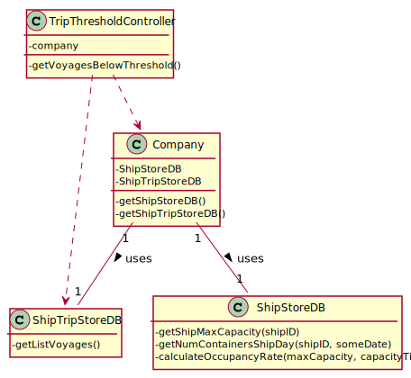

# README

This is the repository template used for student repositories in LAPR Projets.

## Java source files

Java source and test files are located in folder src.

## Maven file

Pom.xml file controls the project build.

### Notes
In this file, DO NOT EDIT the following elements:

* groupID
* artifactID
* version
* properties

Beside, students can only add dependencies to the specified section of this file.

## Eclipse files

The following files are solely used by Eclipse IDE:

* .classpath
* .project

## IntelliJ Idea IDE files

The following folder is solely used by Intellij Idea IDE :

* .idea

# How was the .gitignore file generated?
.gitignore file was generated based on https://www.gitignore.io/ with the following keywords:

  - Java
  - Maven
  - Eclipse
  - NetBeans
  - Intellij

# Who do I talk to?
In case you have any problem, please email Nuno Bettencourt (nmb@isep.ipp.pt).

# How do I use Maven?

## How to run unit tests?

Execute the "test" goals.

```shell
$ mvn test
```
## How to generate the javadoc for source code?

Execute the "javadoc:javadoc" goal.

```shell
$ mvn javadoc:javadoc
```
This generates the source code javadoc in folder "target/site/apidocs/index.html".

## How to generate the javadoc for test cases code?

Execute the "javadoc:test-javadoc" goal.

```shell
$ mvn javadoc:test-javadoc
```
This generates the test cases javadoc in folder "target/site/testapidocs/index.html".

## How to generate Jacoco's Code Coverage Report?

Execute the "jacoco:report" goal.

```shell
$ mvn test jacoco:report
```

This generates a jacoco code coverage report in folder "target/site/jacoco/index.html".

## How to generate PIT Mutation Code Coverage?

Execute the "org.pitest:pitest-maven:mutationCoverage" goal.

```shell
$ mvn test org.pitest:pitest-maven:mutationCoverage
```
This generates a PIT Mutation coverage report in folder "target/pit-reports/YYYYMMDDHHMI".

## How to combine different maven goals in one step?

You can combine different maven goals in the same command. For example, to locally run your project just like on jenkins, use:

```shell
$ mvn clean test jacoco:report org.pitest:pitest-maven:mutationCoverage
```
## How to perform a faster pit mutation analysis?

Do not clean build => remove "clean"

Reuse the previous report => add "-Dsonar.pitest.mode=reuseReport"

Use more threads to perform the analysis. The number is dependent on each computer CPU => add "-Dthreads=4"

Temporarily remove timestamps from reports.

Example:
```shell
$ mvn test jacoco:report org.pitest:pitest-maven:mutationCoverage -DhistoryInputFile=target/fasterPitMutationTesting-history.txt -DhistoryOutputFile=target/fasterPitMutationTesting-history.txt -Dsonar.pitest.mode=reuseReport -Dthreads=4 -DtimestampedReports=false
```
## Where do I configure my database connection?

Each group should configure their database connection on the file:
* src/main/resources/application.properties  

# RELATORY

# SPRINT 1

# US 101 - Import ships from a text file into a BST

## 1. Requirements Engineering

### 1.1. User Story Description

As a traffic manager, I wish to import ships from a text file into a BST

### 1.2. Acceptance Criteria

* no data lost.

### 1.4. Found out Dependencies

This US doesn't have any dependencies.

### 1.5 Input and Output Data

**Input Data:**

* Typed data:
  * text file path

* Selected data:
  * n/a


**Output Data:**

* operation success/failure


### 1.6. System Sequence Diagram (SSD)

!


### 1.7 Other Relevant Remarks

The present US isn't held many times during the business. As the business grows, the company might import new ships to the software system, but probably these ships won't be added individually and will only be added once in a large amount of time.


## 2. OO Analysis

### 2.1. Relevant Domain Model Excerpt


### 2.2. Other Remarks

n/a


## 3. Design - User Story Realization

## 3.1. Sequence Diagram (SD)


## 3.2. Class Diagram (CD)


# 4. Tests

### ImportShipsController class test:

**Test 1:** Test to check if the Ships are being imported respecting all the data restrictions.

In order to test this, it's important to create two test .CSV files: one with ships to be imported (it's important that these ships have errors in their attribute values),
and one with only the ships that, after the filtration, are actually imported.
After using the importShipFromFile method (from the Controller) in the ships from the first file, 
only the ones in the second file should be imported.

**Test 2:** Test to check how many ships from a file are imported and which lines do not import.

This test should import the Ships and print the number of the lines that do not import. It should also increment a counting variable everytime a line is imported and print it at the end.


### Ship class tests:

**Test 3:** Ensure empty Positions BST are not allowed

**Test 4:** Ensure MMSI cannot have less than 9 digits.

**Test 5:** Ensure MMSI cannot have more than 9 digits.

**Test 6:** Ensure Vessel Name cannot be null.

**Test 7:** Ensure IMO cannot be blank.

**Test 8:** Ensure IMO cannot have less than 10 chars.

**Test 9:** Ensure IMO cannot have more than 10 chars.

**Test 10:** Ensure IMO starts with "IMO".

**Test 11:** Ensure IMO has only numeric digits after the "IMO" part.

**Test 12:** Ensure Length cannot be under or equal to 0.

**Test 13:** Ensure Width cannot be under or equal to 0.

**Test 14:** Ensure Draft cannot be under or equal to 0.

**Test 15:** Ensure Cargo cannot be under or equal to 0.

**Test 16:** Ensure Cargo can be 0.

**Test 17:** Ensure Cargo can be NA.

Tests 3 to 17 follow this format:

```
@Test
    public void testName() {
      IllegalArgumentException thrown = assertThrows(IllegalArgumentException.class, () -> new Ship(positionsBST, mmsi, vesselName, imo, callSign, vesselTypeID, length, width, draft, cargo));
      assertEquals(".........", thrown.getMessage());
    }
```

The only change in the tests are the test name, the attributes values and the assertEquals.


### ShipPosition class tests:

**Test 18:** Ensure Base Date Time cannot be null.

**Test 19:** Ensure Transciever Class cannot be null.

**Test 20:** Ensure Transciever Class cannot be empty.

**Test 21:** Ensure Latitude cannot be under -90.

**Test 22:** Ensure Latitude cannot be over 91.

**Test 23:** Ensure Latitude can have value 90.

**Test 24:** Ensure Latitude can have value -90.

**Test 25:** Ensure Longitude cannot be under -180.

**Test 26:** Ensure Longitude cannot be over 180.

**Test 27:** Ensure Longitude can have value 180.

**Test 28:** Ensure Longitude can have value -180.

**Test 29:** Ensure SOG cannot be under 0.

**Test 30:** Ensure SOG can have value 0.

**Test 31:** Ensure COG cannot be under 0.

**Test 32:** Ensure Heading cannot be over 359.

**Test 33:** Ensure COG can have value 359.

**Test 34:** Ensure Heading cannot be under 0.

**Test 35:** Ensure Heading cannot be over 511.

**Test 36:** Ensure Heading can have value 0.

**Test 37:** Ensure Heading can have valie 359.

**Test 38:** Ensure MMSI has 9 digits.

**Test 39:** Ensure MMSI cannot have more than 9 digits.

**Test 40:** Ensure MMSI cannot have less than 9 digits.

Tests 18 to 40 follow this format:

```
@Test
    public void testName() {
      IllegalArgumentException thrown = assertThrows(IllegalArgumentException.class, () -> new ShipPosition(mmsi, date, lat,
                lon, sog, cog, heading, transcieverClass));
      assertEquals(".........", thrown.getMessage());
    }
```

The only change in the tests are the test name, the attributes values and the assertEquals.


# US_102 - to search the details of a ship using any of its codes: MMSI, IMO or Call Sign

## 1. Requirements Engineering

### 1.1. User Story Description

As a **traffic manager**, I wish to search the details of a ship using **any of its codes**: MMSI, IMO or Call Sign

### 1.2. Customer Specifications and Clarifications


**From the client clarifications:**

> **Question:Should the traffic manager choose which type of code(MMSI, IMO, Call sign) to enter and then enter it or should the system automatically recognize which code is it depending on the syntax of the code??
>
> **Answer:** Humm, if it is possible, it would be better to recognise it automatically.


### 1.3. Acceptance Criteria

* **AC1:** correct use of OOP concepts


### 1.5 Input and Output Data

**Input Data:**

* Typed data:
    * code

**Output Data:**

* ship details
* operation success/failure


### 1.6. System Sequence Diagram (SSD)


### 1.7 Other Relevant Remarks

The present US is held many times during the business. As the traffic manager does his daily work, he will probably come across with the need to search for ship details many times.


## 2. OO Analysis

### 2.1. Relevant Domain Model Excerpt


### 2.2. Other Remarks

n/a


## 3. Design - User Story Realization

## 3.2. Sequence Diagram (SD)

### 3.2.1 Sequence Diagram


## 3.3. Class Diagram (CD)

### 3.3.1 Class Diagram


# 4. Tests

###4.1 ShipStore class tests:
**Test 1:** Check if method getShipByAnyCode(code) chooses the right type of code depending on syntax.

**Test 2:** Check if method getShipByAnyCode(code) returns the right ship with MMSI code.

**Test 3:** Check if method getShipByAnyCode(code) returns the right ship with IMO code.

**Test 4:** Check if method getShipByAnyCode(code) returns the right ship with CallSign code.

###4.1 ShipBST classes tests:

**Test 5:** Check if search by code method is working properly.

###4.1 Ship class tests:

**Test 6:** Check if getters methods are returning the expected values.

###4.1 searchShipController class tests:

**Test 7:** Check if the integration of all methods is working properly.  


# US 103 - Show Positional Messages

## 1. Requirements Engineering

### 1.1. User Story Description

As a traffic manager, I wish to have the positional messages temporally organized and associated with each of the ships.

### 1.2. Acceptance Criteria

* efficient access of any position value(s) of a ship on a period or date.

### 1.4. Found out Dependencies

* US101: Import ships from a text file into a BST

### 1.5 Input and Output Data

**Input Data:**

* Typed data:
    * MMSI code of ship
    * initial date
    * final date (optional)

* Selected data:
    * n/a


**Output Data:**

* file containing positional messages of the ship


### 1.6. System Sequence Diagram (SSD)




### 1.7 Other Relevant Remarks

n/a


## 2. OO Analysis

### 2.1. Relevant Domain Model Excerpt


### 2.2. Other Remarks

n/a


## 3. Design - User Story Realization

## 3.1. Sequence Diagram (SD)


## 3.2. Class Diagram (CD)


# 4. Tests

### Ship class

**Test 1:** Test to ensure getShipByMmsiCode() is functioning correctly.

Situation 1: the user inserts a MMSI code existent in the system  

1) an expected Ship object should be created  
2) the MMSI code of the ship should be put in the parameter of the method getShipByMmsiCode(int mmsiCode)  
3) an actual Ship object through calling the method  
4) result: the method returns the corresponding Ship and the Ship objects are equal

```
@Test
    public void getShipByExistentMmsiCode() {
    }
```

**Test 2:** Test to ensure getShipByMmsiCode() is functioning correctly.

Situation 2: the user inserts a MMSI code NON existent in the system  

1) the invalid MMSI code of the ship should be put in the parameter of the method getShipByMmsiCode(int mmsiCode)  
2) an actual Ship object through calling the method  
3) result: the method returns null as the Ship with that MMSI doesn't exist  

```
@Test
    public void getShipByNonExistentMmsiCode() {
    }
```

### PositionsBST Class

**Test 3:** Test to ensure getPositionalMessages() is functioning properly

Situation 1: the user wishes to see ship positions in a period  

1) two Date objects should be created with the initial and final date  
2) an expected List object should be created containing the expected result (toString of multiple ShipPositions objects)  
3) the actual List object through calling the method getPositionalMessages()  
4) result: the Lists should be equal  

```
@Test
    public void getPositionalMessagesInAPeriod() {
    }
```

**Test 4:** Test to ensure getPositionalMessages() is functioning properly

Situation 2: the user wishes to see ship positions in a date

1) a Date object should be created  
2) an expected List object should be created containing the expected result (toString of multiple ShipPositions objects)  
3) the actual List object through calling the method getPositionalMessages()  
4) result: the Lists should be equal  

```
@Test
    public void getPositionalMessagesInADate() {
    }
```

**Test 5:** Test to ensure getPositionalMessages() is functioning properly.

Situation 3: there aren't any positional messages found

1) two Date objects should be created with the initial and final date  
2) an expected empty List object  
3) the actual List object through calling the method getPositionalMessages()  
4) result: the Lists should be equal  

```
@Test
    public void getPositionalMessagesNotFoundInAPeriod() {
    }
```


# US 104 -As a traffic manager I wish to make a Summary of a ship's movements.

## 1. Requirements Engineering

*In this section, it is suggested to capture the requirement description and specifications as provided by the client as well as any further clarification on it. It is also suggested to capture the requirements acceptance criteria and existing dependencies to other requirements. At last, identfy the involved input and output data and depicted an Actor-System interaction in order to fulfill the requirement.*

### 1.1. User Story Description

As a **traffic manager** I wish to **make a Summary of a ship's movements.**

### 1.2. Customer Specifications and Clarifications

**From the specifications document:**
>Ships are characterized by:
>- MMSI: unique 9-digit ship identification code.
>- Ship name.
>- Ship identification according to the IMO identification.
>- ...
>- Dynamic data fields relating to a ship's positioning data:
>- Base Date Time: date/time of AIS message.
>- Latitude
>- Longitude
>- Speed over ground (SOG).
>- Course over ground (COG): direction relative to absolute North (in degrees: [0; 359]).
>- Heading: ship heading (in degrees: [0; 359], 511 indicates 'not available').
>- Position: ship code in tow.
>- Transceiver Class: class to transceiver used when sending data.

**From the client clarifications:**

>Q1: How shold the ship be selected, from MMSI code, name or IMO?
>
>A2: Any of them.

### 1.3. Acceptance Criteria

* **AC1:** For a given ship return in an appropriate structure one of its codes
  (MMSI, IMO or Call Sign), Vessel Name, Start Base Date Time, End
  Base Date Time, Total Movement Time, Total Number of Movements,
  Max SOG, Mean SOG, Max COG, Mean COG, Departure Latitude,
  Departure Longitude, Arrival Latitude, Arrival Longitude, Travelled
  Distance (incremental sum of the distance between each positioning
  message) and Delta Distance (linear distance between the coordinates of
  the first and last move).

### 1.4. Found out Dependencies

There is a depencency with the craetion of a Ship object, and also with the existence of a Traffic manager role to exist be registered.

### 1.5 Input and Output Data

### 1.6 System Sequence Diagram (SSD)


### 1.7 Other Relevant Remarks

## 2. OO Analysis

### 2.1. Relevant Domain Model Excerpt
*In this section, it is suggested to present an excerpt of the domain model that is seen as relevant to fulfill this requirement.*


### 2.2. Other Remarks

n/a

## 3. Design - User Story Realization

## 3.2. Sequence Diagram (SD)

*In this section, it is suggested to present an UML dynamic view stating the sequence of domain related software objects' interactions that allows to fulfill the requirement.*


## 3.3. Class Diagram (CD)

*In this section, it is suggested to present an UML static view representing the main domain related software classes that are involved in fulfilling the requirement as well as and their relations, attributes and methods.*


# 4. Tests
*In this section, it is suggested to systematize how the tests were designed to allow a correct measurement of requirements fulfilling.*

**_DO NOT COPY ALL DEVELOPED TESTS HERE_**

###4.1 Ship class tests:
**Test 1:** Check if both getName and getMovements return the expected values.
### 4.2 ShipBst
**Test 2:** Check if the ship is correctly retrieved from MMSI code

### 4.3 ShipMovementsBst tests:
**Test 3** Check if the tree correctly finds the first and last node by dates:
- **Test 3.1** Check if start and end dates are correct.
- **Test 3.2** Check if depart latitude and longitude values are correct.
- **Test 3.3** Check if arrival latitude and longitude values are correct.

**Test 4** Check if Max Sog and Cog values are obtained as expected.

**Test 5** Check if mean values of sog and cog are correct.

**Test 6** Check if calculations of Delta and Travel distances are correct.

### ShipPosition
**Test 7** Check if getters are returning the correct values of attributes  


# US 107 - Show Pairs Of Ships

## 1. Requirements Engineering

### 1.1. User Story Description

As a traffic manager, I wish to have the pairs of ships with route with close departure/arrival coordinates (no more than 5 Kms away) and with different Travelled Distance.

### 1.2. Customer Specifications and Clarifications

### 1.3. Acceptance Criteria

**AC1:** Sorted by the MMSI code of the 1st ship and in descending order of the Travelled Distance difference.    
**AC2:** Do not consider ships with Travelled Distance less than 10 kms.


### 1.4. Found out Dependencies

**US101:** Import ships from a text file into a BST  
**US104:** Summary of a Ship's Movements

### 1.5 Input and Output Data

**Input Data:** n/a

**Output Data:**

* file containing the wished pairs of ships


### 1.6. System Sequence Diagram (SSD)


### 1.7 Other Relevant Remarks

n/a


## 2. OO Analysis

### 2.1. Relevant Domain Model Excerpt


### 2.2. Other Remarks

n/a


## 3. Design - User Story Realization

## 3.1. Sequence Diagram (SD)


### 3.1.1 Partial Sequence Diagram


## 3.3. Class Diagram (CD)


# 4. Tests

### ShipsBST Class

**Test 1:** Test to ensure getShipsInOrderWithIntendedTD works correctly.  
Steps: 

1) an expected List<Ship> should be created      
2) the list should be filled with Ship objects in the intended order   
3) obtain the actual list through calling the method getShipsInOrderWithIntendedTD()    
4) result: the lists are equal    

```
@Test
    void getShipsInOrderWithIntendedTD() {
    }
```

**Test 2:** Test to ensure fillTreeMapEachShip() works correctly.  
Steps:

1) create or get a List<Ship> containing a list of Ship objects  
2) create an expected descending TreeMap using Collections.reverseOrder()  
3) create the actual descending TreeMap using Collections.reverseOrder()  
4) obtain the first Ship object of the List<Ship> created  
5) obtain the index of that Ship  
6) obtain the PositionsBST of that Ship  
7) obtain the Travelled Distance of that Ship  
8) fill the actual TreeMap using the method fillTreeMapForEachShip using the objects and info obtained  
9) result: the list should be equal or if empty, their sizes should be equal  

```
@Test
    void fillTreeMapForEachShip() {
    }
```  

**Test 3:** Test to ensure getPairsOfShips() works correctly.  
Steps:  

1) create an expected List<TreeMap<Double, String>> containing the expected result if the result is not empty  
2) create the actual through calling the method getPairsOfShips  
3) result: the lists should be equal or its sizes, if the result is empty  

```
@Test
    void getPairsOfShips() {
    }
```  

OBSERVATION: To facilitate testing this method, we can import information in a .csv file using Controller available from US101.

### PositionsBST Class

**Test 1:** Test to ensure getArrivalDistance(positionsBST2) works properly.  
Steps:  

1) create a double with the expected result  
2) create 2 Ship objects with Ship Positions  
3) obtain the actual result through calling the method  
4) result: the results are equal  

```
public Double getArrivalDistance(positionsBST2) {
}
```

**Test 2:** Test to ensure getDepartureDistance(positionsBST2) works properly.
Steps: see steps from the previous test and use the same logic

```
public Double getDepartureDistance(positionsBST2) {
}
```

# US 105 - List for all ships the MMSI, the total number of movements, Travelled Distance and Delta Distance

## 1. Requirements Engineering


### 1.1. User Story Description


• US105: As a traffic manager I which to list for all ships the MMSI, the total number of
movements, Travelled Distance and Delta Distance.

### 1.2. Customer Specifications and Clarifications

### 1.3. Acceptance Criteria

* **AC1:** ordered by Travelled Distance and total number of movements
  (descending/ascending).

### 1.4. Found out Dependencies

* US101: As a traffic manager, I which to import ships from a text file into a BST.
* US102: As a traffic manager I which to search the details of a ship using any of its codes:
  MMSI, IMO or Call Sign.
* US104:  As a traffic manager I which to make a Summary of a ship's movements.


### 1.5 Input and Output Data
**Input Data:**

* All Ships in BST

**Output Data:**

* for all ships the MMSI, the total number of movements, Travelled Distance and Delta Distance ordered by Travelled Distance and total number of movements
  (descending/ascending).
* (In)Success of the operation

### 1.6. System Sequence Diagram (SSD)


### 1.7 Other Relevant Remarks


## 2. OO Analysis

### 2.1. Relevant Domain Model Excerpt


### 2.2. Other Remarks

n/a


## 3. Design - User Story Realization


## 3.2. Sequence Diagram (SD)


## 3.3. Class Diagram (CD)


# 4. Tests

**ShipBSTTest**

     @Test
    public void getAllShipsNoDuplicates() {
        *add all ships created to a List*

        *assert using getAllShips*
    }
* Test 1: ensure all the ships in the BST are added to a List without duplicates.


    @Test
    public void mapOrderedByTravelledDistance() {
        *add ship's Travelled Distance, Delta Distance and Total Movements to different LinkedHashSets*
        *associate each Set to a Ship MMSI in a LinkedHashMap*

        *assert using sortedByTravelledDistance()*
    }
* Test 2: ensure every Ship's Travelled Distance, Delta Distance and Total Movements are associated with it's MMSI and ordered by Travelled Distance (descending)


     @Test
    public void mapOrderedByMovements() {
        *add ship's Travelled Distance, Delta Distance and Total Movements to different LinkedHashSets*
        *associate each Set to a Ship MMSI in a LinkedHashMap*

        *assert using sortedByTotalMovements()*
    }
* Test 3: ensure every Ship's Travelled Distance, Delta Distance and Total Movements are associated with it's MMSI and ordered by Total Movements (ascending)


# US 106 - Top-N ships and MeanSOG

## 1. Requirements Engineering


### 1.1. User Story Description


• US16:Get the top-N ships with the most kilometres travelled and their average speed
(MeanSOG).

### 1.2. Customer Specifications and Clarifications

**From the client clarifications:**

> **Question:** "...in the US106 when it says "in a period (initial/final Base Date Time) grouped by Vessel Type", does the traffic manager specify the initial and final Date that he wants to search in?"
>
> **Answer:** "Yes."


-

> **Question:** "Regarding both US106 and US107 should we assume that these functionalities will be used by the Traffic Manager or is it for another role in the company? This detail is not present, unlike in the other User Stories."
>
> **Answer:** "
Yes, you can assume a Traffic Manager will be performing those tasks."


### 1.3. Acceptance Criteria

* **AC1:** ordered by Travelled Distance and total number of movements
  (descending/ascending).


### 1.4. Found out Dependencies

* US101: As a traffic manager, I which to import ships from a text file into a BST.
* US102: As a traffic manager I which to search the details of a ship using any of its codes:
  MMSI, IMO or Call Sign.
* US104:  As a traffic manager I which to make a Summary of a ship's movements.


### 1.5 Input and Output Data
**Input Data:**

* Initial Base Date Time;
* Final Base Date Time;
* Number of ships to get;

**Output Data:**

* Top-N ships with the most km travelled and their meanSOG
* (In)Success of the operation

### 1.6. System Sequence Diagram (SSD)


### 1.7 Other Relevant Remarks

n/a


## 2. OO Analysis

### 2.1. Relevant Domain Model Excerpt


### 2.2. Other Remarks

n/a


## 3. Design - User Story Realization


## 3.2. Sequence Diagram (SD)


## 3.3. Class Diagram (CD)


# 4. Tests

**ShipBSTTest**

     @Test
    public void getShipsByDateCorrect() throws ParseException {
        *add N ships with different positionBST and different Base Date Time*

        *assert using getShipsByDate(initilDate. finalDate)*
    }
* Test 1: ensures all the ships that fit in the Base Date Time gap are correctly obtained and put in an ArrayList.


    @Test
    public void sortNshipsCorrect() throws ParseException {
        *add N ships to a LinkedList by order of TravelledDistance*
        
        *assert using sortNShips(List<Ship>)*
    }
* Test 2: ensures a list of Ships is ordered correctly by Travelled Distance.


     @Test
    public void getMapWithTopNAssociatedWithVesselType(){
        *create HashMap with LinkedList associated with Ship*
        *create HashMap with HashMap associated with vesselTypeId*
        
        *assert using getShipWithMean(List<Ship>, Integer topN)
    }
* Test 3: ensures every Vessel Type has Top-N Ships with the most Travelled Distance associated with it.


# SPRINT 2

# US 104 - Get Container Situation

## 1. Requirements Engineering

### 1.1. User Story Description

As Client, I want to know the current situation of a specific container being used to transport my goods.

### 1.2. Acceptance Criteria

* Clients provide the container identifier and get the type and the concrete
  instance of its current location, e.g., PORT, Leixões or SHIP, WeFly.

### 1.5 Input and Output Data

**Input Data:**

* Typed data:
  * Container ID
  * Shipment ID

* Selected data:
  * n/a


**Output Data:**

* type and concrete instance of container location


### 1.6. System Sequence Diagram (SSD)


### 1.7 Other Relevant Remarks

n/a


## 2. OO Analysis

### 2.1. Relevant Domain Model Excerpt


### 2.2. Other Remarks

n/a


## 3. Design - User Story Realization

## 3.1. Sequence Diagram (SD)


## 3.2. Class Diagram (CD)


# 4. Tests

For the tests, it is needed to instanciate a Datebaseconnection object and Callable Statement to connect with Data Base.

### ShipTripStoreDB class

**Test 1:** Test to ensure getShipTripID() is functioning correctly.
```
@Test
    public void getShipTripID() {
    }
```

**Test 2:** Test to ensure getLocation() is functioning correctly.
```
@Test
    public void getLocation() {
    }
```

### GetContainerSituationController Class

**Test 3:** Test to ensure getLocation() is functioning properly
```
@Test
    public void getLocation(containerID, shipmentID) {
    }
```


# US 104 - Get Available Ships on Monday Next Week

## 1. Requirements Engineering

### 1.1. User Story Description

As Traffic manager, I need to know which ships will be available on Monday next week and their location.

### 1.2. Acceptance Criteria

* Monday next week is properly identified.
* Only available ships are returned.
* All available ships are returned.

### 1.5 Input and Output Data

**Input Data:**

* Typed data:
  * n/a

* Selected data:
  * n/a


**Output Data:**

* available ships next monday next week


### 1.6. System Sequence Diagram (SSD)


### 1.7 Other Relevant Remarks

n/a


## 2. OO Analysis

### 2.1. Relevant Domain Model Excerpt


### 2.2. Other Remarks

n/a


## 3. Design - User Story Realization

## 3.1. Sequence Diagram (SD)



## 3.2. Class Diagram (CD)


# 4. Tests

For the tests, it is needed to instanciate a Datebaseconnection object and Callable Statement to connect with Data Base.

### ShipTripStoreDB class

**Test 1:** Test to ensure getNextMondayAvailableShips() is functioning correctly.
```
@Test
    public void getNextMondayAvailableShips() {
    }
```

### FindAvailableShipsController Class

**Test 3:** Test to ensure getNextMondayAvailableShips() is functioning properly
```
@Test
    public void getNextMondayAvailableShips() {
    }
```


# US 205 - Get List of Containers to be Offloaded in the Next Port

## 1. Requirements Engineering

### 1.1. User Story Description

As Ship Captain, I want the list of containers to be offloaded in the next port, including container identifier, type, position, and load

### 1.2. Acceptance Criteria

* “next port” is properly identified.
* The containers being offloaded are properly identified
* Output is in accordance with the specification wrt the information about each container

### 1.5 Input and Output Data

**Input Data:**

* Typed data:
  * Ship mmsi

* Selected data:
  * n/a


**Output Data:**

* next Port
* list of containers to be offloaded


### 1.6. System Sequence Diagram (SSD)


### 1.7 Other Relevant Remarks

n/a


## 2. OO Analysis

### 2.1. Relevant Domain Model Excerpt


### 2.2. Other Remarks

n/a


## 3. Design - User Story Realization

## 3.1. Sequence Diagram (SD)



## 3.2. Class Diagram (CD)


# 4. Tests

For the tests, it is needed to instanciate a Datebaseconnection object and Callable Statement to connect with Data Base.

### ShipTripStoreDB class

**Test 1:** Test to ensure getPortIdTest() is functioning correctly.
```
@Test
    public void getPortIdTest() {
    }
```

**Test 2:** Test to ensure getOffloadedListTest() is functioning properly
```
@Test
    public void getOffloadedListTest() {
    }
```

### ContainersOffLoadedController Class

**Test 3:** Test to ensure getOffloadedListTest() is functioning properly
```
@Test
    public void getOffloadedListTest() {
    }
```


# US 206 - Get List of Containers to be Loaded in the Next Port

## 1. Requirements Engineering

### 1.1. User Story Description

As Ship Captain, I want the list of containers to be loaded in the next port, including container identifier, type, and load.

### 1.2. Acceptance Criteria

* “next port” is properly identified.
* The containers being loaded are properly identified
* Output is in accordance with the specification wrt the information about each container

### 1.5 Input and Output Data

**Input Data:**

* Typed data:
  * Ship mmsi

* Selected data:
  * n/a


**Output Data:**

* next Port
* list of containers to be loaded


### 1.6. System Sequence Diagram (SSD)


### 1.7 Other Relevant Remarks

n/a


## 2. OO Analysis

### 2.1. Relevant Domain Model Excerpt


### 2.2. Other Remarks

n/a


## 3. Design - User Story Realization

## 3.1. Sequence Diagram (SD)


## 3.2. Class Diagram (CD)


# 4. Tests

For the tests, it is needed to instanciate a Datebaseconnection object and Callable Statement to connect with Data Base.

### ShipTripStoreDB class

**Test 1:** Test to ensure getPortIdTest() is functioning correctly.
```
@Test
    public void getPortIdTest() {
    }
```

**Test 2:** Test to ensure getLoadedListTest() is functioning properly
```
@Test
    public void getLoadedListTest() {
    }
```

### ContainersLoadedController Class

**Test 3:** Test to ensure getOffloadedListTest() is functioning properly
```
@Test
    public void getOffloadedListTest() {
    }
```

# US 207 -As Ship Captain, I want to know how many cargo manifests I have transported during a given year and the average number of containers per manifest.

## 1. Requirements Engineering

*In this section, it is suggested to capture the requirement description and specifications as provided by the client as well as any further clarification on it. It is also suggested to capture the requirements acceptance criteria and existing dependencies to other requirements. At last, identfy the involved input and output data and depicted an Actor-System interaction in order to fulfill the requirement.*

### 1.1. User Story Description

As **Ship Captain**, I want to know how many **cargo manifests** I have transported during a given year and the **average number of containers** per manifest.

### 1.2. Customer Specifications and Clarifications

**From the specifications document:**

>The system is to be used by the following people:
>
> ...
>
> Ship captain – someone who oversees ship operations

>Each time a ship docks at a port or a truck arrives at a location, an Unloading Cargo Manifest is
delivered to the operations team at the port or warehouse and at the end of operations a Loading
Cargo Manifest is delivered to the ship crew. The same is true for trucks. The Cargo Manifest only has
the necessary information about the containers that are being loaded and unloaded.

**From the client clarifications:**

>Q1: How shold the ship be selected, from MMSI code, name or IMO?
>
>A2: Any of them.

### 1.3. Acceptance Criteria

* **AC1:** Only the cargo manifests of the specified year are considered.
* **AC2:** Average containers per cargo manifest are properly computed.

### 1.4. Found out Dependencies

There is a dependency with the existence of the cargo manifest and container classes, and also with US111: "As Project Manager, I want the team to create a SQL script to load the database
with a minimum set of data sufficient to carry out data integrity verification and functional testing".

### 1.5 Input and Output Data

**Input data:**
The year to search for cargo manifests.

### 1.6 System Sequence Diagram (SSD)


### 1.7 Other Relevant Remarks

## 2. OO Analysis

### 2.1. Relevant Domain Model Excerpt
*In this section, it is suggested to present an excerpt of the domain model that is seen as relevant to fulfill this requirement.*


### 2.2. Other Remarks

n/a

## 3. Design - User Story Realization

### 3.1. Rationale

**The rationale grounds on the SSD interactions and the identified input/output data.**

| Interaction ID                                                                                                                | Question: Which class is responsible for...                                 | Answer               | Justification (with patterns)                                                                                                       |
|:------------------------------------------------------------------------------------------------------------------------------|:----------------------------------------------------------------------------|:---------------------|:------------------------------------------------------------------------------------------------------------------------------------|
| Step 1: asks how many cargo manifests were transported during a given year and the average number of containers per manifest. | 	        n/a	                                                               |                      |                                                                                                                                     |
| Step 2: Asks what ship's code to search for                                                                                   | 			n/a				                                                                  |                      |                                                                                                                                     |
| Step 3: Types requested data		                                                                                                | 			...knowing which ship to search for                                      | App                  | Pure fabrication: The Ship Captain is assigned to a ship registered in the database retrieved from the App controller               |
| 		                                                                                                                            | 			... knowing how many cargo manifests a ship transported in a given year? | ShipStoreDatabase    | IE: The shipstoredatabase is responsible for consulting the database and therefore knows all the cargo manifests                    |
| 		                                                                                                                            | 			... knowing the average number of containers per manifest                | ShipStoreDatabase | IE: The shipstoredatabase  is responsible for consulting the database and therefore knows all the containers in cargo manifest |
| Step 4: Shows number of cargo manifests and average container number                                                          | 			n/a                                                                      | n/a         | n/a                                       |              

### Systematization ##

According to the taken rationale, the conceptual classes promoted to software classes are:

* Ship
* CargoManifest
* Container

Other software classes (i.e. Pure Fabrication) identified:
* ShipStoreDatabase
* App

## 3.2. Sequence Diagram (SD)

*In this section, it is suggested to present an UML dynamic view stating the sequence of domain related software objects' interactions that allows to fulfill the requirement.*


## 3.3. Class Diagram (CD)

*In this section, it is suggested to present an UML static view representing the main domain related software classes that are involved in fulfilling the requirement as well as and their relations, attributes and methods.*


# 4. Tests
*In this section, it is suggested to systematize how the tests were designed to allow a correct measurement of requirements fulfilling.*

###4.1 Controller class tests:
**Test 1:** Check if the integration of the functionality works as expected


# US 202 - Find nearest Port to a Ship

## 1. Requirements Engineering

### 1.1. User Story Description

As a Traffic manager, I which to find the closest port of a ship given its CallSign, on a certain DateTime.
### 1.2. Acceptance Criteria

* using 2D-tree to find closest port

### 1.5 Input and Output Data

**Input Data:**

* Typed data:
  * Ship callSign
  * DateTime

* Selected data:
  * n/a


**Output Data:**

* nearest Port to that Ship


### 1.6. System Sequence Diagram (SSD)


### 1.7 Other Relevant Remarks

n/a


## 2. OO Analysis

### 2.1. Relevant Domain Model Excerpt


### 2.2. Other Remarks

n/a


## 3. Design - User Story Realization

## 3.1. Sequence Diagram (SD)


## 3.2. Class Diagram (CD)


# 4. Tests


### PortStoreTest class

**Test 1:** Test to ensure getNearestPort() is functioning correctly.
```
@Test
    public void getNearestPort() {
    }
```

### NearestPortController Class

**Test 2:** Test to ensure getShipByCallSignTest() is functioning properly
```
@Test
    public void getShipByCallSignTest() {
    }
```

**Test 3:** Test to ensure getShipCoordinatesTest() is functioning properly
```
@Test
    public void getShipCoordinatesTest() {
    }
```

**Test 4:** Test to ensure findClosestPortTest() is functioning properly
```
@Test
    public void findClosestPortTest() {
    }
```


# US 208 - Know the occupancy rate (percentage) of a given ship for a given cargo manifest

## 1. Requirements Engineering

### 1.1. User Story Description

As a Ship Captain, I want to know the occupancy rate (percentage) of a given ship for a given cargo manifest.
Occupancy rate is the ratio between total number of containers in the ship coming from a given manifest and
the total capacity of the ship, i.e., the maximum number of containers the ship can load.

### 1.2. Acceptance Criteria

* Ship and cargo manifest is correctly identified.
* Occupancy rate is properly computed.

### 1.3. Found out Dependencies

This US has dependencies with the US101, since the business data base needs to exist in order to analyze it.

### 1.4 Input and Output Data

**Input Data:**

* Typed data:
  * cargoManifestID

* Selected data:
  * n/a


**Output Data:**

* occupancy rate of a give ship for a given cargo manifest


### 1.5. System Sequence Diagram (SSD)


### 1.6 Other Relevant Remarks

The present US is held many times during the business. As the Ship Captain manages his ship, he will need to know its occupancy rate many times.


## 2. OO Analysis

### 2.1. Relevant Domain Model Excerpt


### 2.2. Other Remarks

n/a


## 3. Design - User Story Realization

## 3.1. Sequence Diagram (SD)


## 3.2. Class Diagram (CD)


# 4. Tests

### ShipOccupancyRatesController class test:

**Test 1:** Test to check if the occupancy rate is correctly calculates when the values are valid.

In order to test this, it's important to define valid values for maxCapacity, initialNumContainers, addedContainersNum and removedContainersNum.
Then, the occupancy rate should be manually calculated and its result should be compared with the one given by the algorithm.

**Test 2:** Test to check if the occupancy rate is -1 when the values are invalid.

This test is similar with test 1, but should have invalid values (result <0% or >100%).
Then, the returned value given by the algorithm should be -1.

**Test 3:** Test to check the occupancy rate by cargo manifest is correctly calculated when the cargo manifest exists in the Data Base.

**Test 4:** Test to check the occupancy rate by mmsi and date is correctly calculated when the ship with the given mmsi exists in the Data Base.

**Test 5:** Test to check the occupancy rate by cargo manifest throws an exception when the cargo manifest doesn't exist in the Data Base.

**Test 6:** Test to check the occupancy rate by mmsi and date throws an exception when the ship doesn't exist in the Data Base.

**Test 7:** Test to check the occupancy rate by mmsi and date is 0% when the ship has no ship trips in the Data Base as for before the given date.


# US 209 - Know the occupancy rate of a given ship at a given moment

## 1. Requirements Engineering

### 1.1. User Story Description

As a Ship Captain, I want to know the occupancy rate of a given ship at a given moment

### 1.2. Acceptance Criteria

* Ship is properly identified.
* Reuses US208.
* Occupancy rate is properly computed.

### 1.3. Found out Dependencies

This US has dependencies with the US101, since the business data base needs to exist in order to analyze it, and US208, since it reuses its methods.

### 1.4 Input and Output Data

**Input Data:**

* Typed data:
  * mmsi
  * date

* Selected data:
  * n/a


**Output Data:**

* occupancy rate of a give ship at a given moment


### 1.5. System Sequence Diagram (SSD)


### 1.6 Other Relevant Remarks

The present US is held many times during the business. As the Ship Captain manages his ship, he will need to know its occupancy rate many times.


## 2. OO Analysis

### 2.1. Relevant Domain Model Excerpt


### 2.2. Other Remarks

n/a


## 3. Design - User Story Realization

## 3.1. Sequence Diagram (SD)


## 3.2. Class Diagram (CD)


# 4. Tests

### ShipOccupancyRatesController class test:

**Test 1:** Test to check if the occupancy rate is correctly calculates when the values are valid.

In order to test this, it's important to define valid values for maxCapacity, initialNumContainers, addedContainersNum and removedContainersNum.
Then, the occupancy rate should be manually calculated and its result should be compared with the one given by the algorithm.

**Test 2:** Test to check if the occupancy rate is -1 when the values are invalid.

This test is similar with test 1, but should have invalid values (result <0% or >100%).
Then, the returned value given by the algorithm should be -1.

**Test 3:** Test to check the occupancy rate by cargo manifest is correctly calculated when the cargo manifest exists in the Data Base.

**Test 4:** Test to check the occupancy rate by mmsi and date is correctly calculated when the ship with the given mmsi exists in the Data Base.

**Test 5:** Test to check the occupancy rate by cargo manifest throws an exception when the cargo manifest doesn't exist in the Data Base.

**Test 6:** Test to check the occupancy rate by mmsi and date throws an exception when the ship doesn't exist in the Data Base.

**Test 7:** Test to check the occupancy rate by mmsi and date is 0% when the ship has no ship trips in the Data Base as for before the given date.

# US 104 - Get Available Ships on Monday Next Week

## 1. Requirements Engineering

### 1.1. User Story Description

As Traffic manager, I need to know which ships will be available on Monday next week and their location.

### 1.2. Acceptance Criteria

* Monday next week is properly identified.
* Only available ships are returned.
* All available ships are returned.

### 1.5 Input and Output Data

**Input Data:**

* Typed data:
  * n/a

* Selected data:
  * n/a


**Output Data:**

* available ships next monday next week


### 1.6. System Sequence Diagram (SSD)


### 1.7 Other Relevant Remarks

n/a


## 2. OO Analysis

### 2.1. Relevant Domain Model Excerpt


### 2.2. Other Remarks

n/a


## 3. Design - User Story Realization

## 3.1. Sequence Diagram (SD)


## 3.2. Class Diagram (CD)


# 4. Tests

For the tests, it is needed to instanciate a Datebaseconnection object and Callable Statement to connect with Data Base.

### ShipTripStoreDB class

**Test 1:** Test to ensure getNextMondayAvailableShips() is functioning correctly.

### FindAvailableShipsController Class

**Test 3:** Test to ensure getNextMondayAvailableShips() is functioning properly


# US 306 - Know the occupancy rate for each warehouse and an estimate of the containers leaving the warehouse during the next 30 days.

## 1. Requirements Engineering

### 1.1. User Story Description

As a Port manager, I want to know the occupancy rate for each warehouse and an estimate of the containers leaving the warehouse during the next 30 days.

### 1.2. Acceptance Criteria

* For each warehouse the required output is available.
* The 30 days period is properly considered.

### 1.3. Found out Dependencies

This US has no dependencies with other USs, since this is the first US related to the warehouses.

### 1.4 Input and Output Data

**Input Data:**

* Typed data:
  * warehouse id

* Selected data:
  * n/a


**Output Data:**

* Warehouse's occupancy rate and an estimate of the containers leaving the warehouse during the next 30 days.


### 1.5. System Sequence Diagram (SSD)


### 1.6 Other Relevant Remarks

The present US is held many times during the business. As the Port Manager manages the containers, he will need to know which warehouses have enough space for them.


## 2. OO Analysis

### 2.1. Relevant Domain Model Excerpt


### 2.2. Other Remarks

n/a


## 3. Design - User Story Realization

## 3.1. Sequence Diagram (SD)


## 3.2. Class Diagram (CD)


# 4. Tests

### CheckOccupancyRatesAndEstimationsWarehouseController class test:


**Test 1:** First test to check that the occupancy rate is correctly calculated for valid values.

**Test 2:** Second test to check that the occupancy rate is correctly calculated for valid values.

**Test 3:** Test to check that the occupancy rate is -1 (invalid) when the warehouse does not exist.

**Test 4:** Test to check that the number of containers leaving the warehouse in the next 30 days is correctly calculated for valid values.

**Test 5:** Test to check that the number of containers leaving the warehouse in the next 30 days is -1 (invalid) when the warehouse does not exist.


# US 307 - Get a warning whenever a cargo manifest is issued with a warehouse whose available capacity is insufficient as the destiny

## 1. Requirements Engineering

### 1.1. User Story Description

As Port manager, I intend to get a warning whenever I issue a cargo manifest destined for a warehouse whose available capacity is insufficient to accommodate the new manifest.

### 1.2. Acceptance Criteria

* Destination warehouse is properly identified.
* Warehouse available capacity is properly computed.
* The warning is triggered when required.

### 1.3. Found out Dependencies

This US has dependencies with US306, since it reuses it for calculating the warehouse's occupancy rate.

### 1.4 Input and Output Data

**Input Data:**

* Typed data:
  * cargo manifest ID
  * warehouse ID

* Selected data:
  * n/a


**Output Data:**

* If the number of containers in the manifest exceed the Warehouse's available capacity or not.


### 1.5. System Sequence Diagram (SSD)


### 1.6 Other Relevant Remarks

The present US is held many times during the business. As the Port Manager deals with the cargo manifests, he will need to know which warehouses have enough space for the containers to be added.


## 2. OO Analysis

### 2.1. Relevant Domain Model Excerpt


### 2.2. Other Remarks

n/a


## 3. Design - User Story Realization

## 3.1. Sequence Diagram (SD)


## 3.2. Class Diagram (CD)


# 4. Tests

### CheckIfContainerExceedsWarehouseCapacityController class test:


**Test 1:** Test to check that it's possible to create a truck trip when the unloading cargo manifest doesn't exceed the warehouse max capacity.

**Test 2:** Test to check that it isn't possible to create a truck trip when the unloading cargo manifest exceeds the warehouse max capacity.

**Test 3:** Test to check that it's possible to create a truck trip when the unloading cargo manifest doesn't exist.

**Test 4:** Test to check that it's possible to create a truck trip when the truck doesn't exist.


# US 308 - Ensure that the number of containers in a manifest does not exceed the ship's available capacity.

## 1. Requirements Engineering

### 1.1. User Story Description

As a Traffic manager, I want to have a system that ensures that the number of containers in a manifest does not exceed the ship's available capacity.

### 1.2. Acceptance Criteria

* The destination ship is properly identified.
* Ship's available capacity is properly computed.
* The warning is triggered when required.

### 1.3. Found out Dependencies

This US has dependencies with US208 and US209, since it reuses them for calculating the ship's occupancy rate.

### 1.4 Input and Output Data

**Input Data:**

* Typed data:
  * ship trip ID
  * mmsi
  * departure location
  * arrival location
  * loading cargo manifest id
  * estimated departure date
  * estimated arrival date

* Selected data:
  * n/a


**Output Data:**

* If the number of containers in the manifest exceed the Ship's available capacity or not.


### 1.5. System Sequence Diagram (SSD)


### 1.6 Other Relevant Remarks

The present US is held many times during the business. As the Traffic Manager manages the containers, he will need to know which ships have enough space for them.


## 2. OO Analysis

### 2.1. Relevant Domain Model Excerpt


### 2.2. Other Remarks

n/a


## 3. Design - User Story Realization

## 3.1. Sequence Diagram (SD)


## 3.2. Class Diagram (CD)


# 4. Tests

### ShipOccupancyRatesController class test:


**Test 1:** Test to check if that the ship is created when the desired ship has enough space for the containers in the cargo manifest.

**Test 2:** Test to check if the ship is not created when the cargo manifest ID has too much container for the desired ship.

**Test 3:** Test to check if the ship is not created when the cargo manifest ID is invalid.

**Test 4:** Test to check if the ship is not created when the ship ID (mmsi) is invalid.


# US 310 - Have a map of the occupation of the existing resources in the port during a given month.

## 1. Requirements Engineering

### 1.1. User Story Description

As Port manager, I intend to have a map of the occupation of the existing resources in the port during a given month.

### 1.2. Acceptance Criteria

* Occupation of resources is restricted to the month provided.
* The reported occupation respects actual port capacity.

### 1.3. Found out Dependencies

This US has no big dependencies with other USs.

### 1.4 Input and Output Data

**Input Data:**

* Typed data:
  * port ID
  * month
  * year

* Selected data:
  * n/a


**Output Data:**

* A map of the occupation of the existing resources in the port during a given month.


### 1.5. System Sequence Diagram (SSD)


### 1.6 Other Relevant Remarks

The present US is held many times during the business. As the Port Manager manages his port, he will need to know how is its occupacy.


## 2. OO Analysis

### 2.1. Relevant Domain Model Excerpt


### 2.2. Other Remarks

n/a


## 3. Design - User Story Realization

## 3.1. Sequence Diagram (SD)


## 3.2. Class Diagram (CD)


# 4. Tests

### CreateMapContainersPortController class test:


**Test 1:** Test that the given map is correctly made.

**Test 2:** Test that the map is not made for an invalid port id.

**Test 3:** Test that the map is not made for an invalid date (month<1).

**Test 4:** Test that the map is not made for an invalid date (month>12).

**Test 5:** Test that the map is not made for months that have not ended yet.

# US 301 - As a Traffic manager, I which to import data from countries, ports, borders and seadists files from the database to build a freight network.

## 1. Requirements Engineering

### 1.1. User Story Description

As a Traffic manager, I which to import data from countries, ports, borders and seadists files from the database to build a freight network.

### 1.2. Acceptance Criteria

**AC1**: The capital of a country has a direct connection with the capitals of the
countries with which it borders.

**AC1.1**: The ports of a country, besides connecting with all the ports of the same country, the port closest to the
capital of the country connects with it;

**AC1.2**: Each port of a country connects with the n closest ports of any other country

**AC2**:The calculation of distances in Kms between capitals, and ports and
capitals must be done using the GPS coordinates.

**AC3**: The graph must be implemented using the adjacency matrix
representation and ensuring the indistinct manipulation of capitals and
seaports.

### 1.5 Input and Output Data

**Input Data:**

* Typed data:
  * n/a
* Selected data:
  * n/a

**Output Data:**
* succes or failure message
### 1.6. System Sequence Diagram (SSD)


### 1.7 Other Relevant Remarks

n/a


## 2. OO Analysis

### 2.1. Relevant Domain Model Excerpt


### 2.2. Other Remarks

n/a


## 3. Design - User Story Realization

## 3.1. Sequence Diagram (SD)


## 3.2. Class Diagram (CD)


# 4. Tests

For the tests, it is needed to instanciate a Datebaseconnection object and Callable Statement to connect with Data Base.

### CountryStore class

**Test 1:** Ensure Capitals and borders are retrieved correctly.

**Test 2:** Ensure closest port from capital is correct.

### PortStore class

**Test 3:** Ensure Ports and seadists are retrieved correctly.

**Test 4:** Ensure Ports of a given country are retrieved correctly.

### DistanceUtils

**Test 5:** Check if distances are calculated correctlly.

### Controller

**Test 6:** Check if the edges are being estabilished correctly.

# US 302 - Color Map

## 1. Requirements Engineering

### 1.1. User Story Description

As a Traffic manager I wish to colour the map using as few colours as possible.

### 1.2. Acceptance Criteria

* Neighbouring countries must not share the same colour

### 1.4. Found out Dependencies

* US301: Import data from countries, ports, borders and seadists files from the database to build a freight network.


### 1.5 Input and Output Data

**Input Data:**

* Typed data:
  * n/a

* Selected data:
  * n/a


**Output Data:**

* a Map containing each Capital with its respective color


### 1.6. System Sequence Diagram (SSD)


### 1.7 Other Relevant Remarks

n/a


## 2. OO Analysis

### 2.1. Relevant Domain Model Excerpt


### 2.2. Other Remarks

n/a


## 3. Design - User Story Realization

## 3.1. Sequence Diagram (SD)


## 3.2. Class Diagram (CD)


# 4. Tests

### FreightNetwork class

**Test 1:** Test to ensure getOrderedCapitalsList() is functioning correctly.

- an expected list with all the capitals and its colors
- the list through calling the method
- checks whether the lists are equal


**Test 2:** Test to ensure getCapitalsToColor() is functioning correctly.

- an expected map with all the capitals and colors set to null
- the map through calling the method
- checks whether the maps are equal


**Test 3:** Test to ensure colorMap() is functioning properly

Situation 1:
- an expected map with all the capitals and colors
- the map through calling the method
- checks whether the maps are equal

Situation 2:
- the expected minimum colors to be used
- obtain the minimum colors actually used
- checks whether the number of colors are equal

Situation 3: (**for each capital**)
- through the map containing the capitals and colors, obtain the **submap** containing **only** the neighbouring countries of the capital to be tested
- obtain the color of the capital to be tested
- check if the subMap does **not** contain the color of the capital to be tested, meaning **none of the neighbouring countries of the country being tested have the same color of it**


### ColorMapController class

**Test 1:** Test to ensure colorMap() is functioning correctly.

- an expected map with all the capitals and colors set to null
- the map through calling the method
- checks whether the maps are equal


# US 303 - Get closeness locals by continent

## 1. Requirements Engineering

### 1.1. User Story Description

As a Traffic manager I wish to know which places (cities or ports) are closest to all other places (closeness places).

### 1.2. Acceptance Criteria

* Return the n closeness locals by continent
* The measure of proximity is calculated as the average of the shortest path
  length from the local to all other locals in the network

**From the client clarifications:**

>Q1: In US303 we should return the n closest locals by continent, but should we calculate the closest locals by comparing them with locals from all over the world or just from their respective continent?
>
>A2: Should only consider the locations of the continent.
>
> [Link](https://moodle.isep.ipp.pt/mod/forum/discuss.php?d=12650)

### 1.4. Found out Dependencies

* US301: Import data from countries, ports, borders and seadists files from the database to build a freight network.

### 1.5 Input and Output Data

**Input Data:**

* Typed data:
  * n/a

* Selected data:
  * n/a


**Output Data:**

* An Map<String, Map<String, Double>> with each continent closeness locals and it's indices.


### 1.6. System Sequence Diagram (SSD)


### 1.7 Other Relevant Remarks

n/a


## 2. OO Analysis

### 2.1. Relevant Domain Model Excerpt


### 2.2. Other Remarks

n/a


## 3. Design - User Story Realization

## 3.1. Sequence Diagram (SD)


## 3.2. Class Diagram (CD)


# 4. Tests

### FreightNetwork class

**Test 1** Check if existent continents of a locations freight network are obtained correctly.

**Test 2** Check if subgraph of a continent is obtained correctly.

**Test 3** Check if values of closeness are correct.

**Test 4** Check if closeness sort order is correct by continent


# RELATORY

# US 304 - As Ship Captain, I want to have access to audit trails for a given container of a given cargo manifest

## 1. Requirements Engineering

### 1.1. User Story Description

As Ship Captain, I want to have access to audit trails for a given container of a given cargo manifest
### 1.2. Acceptance Criteria

* There is a table for recording audit trails, i.e., record all write-operations
  involving containers of a cargo manifest.
* Proper mechanisms for recording write-operations involving containers
  of a cargo manifest are implemented (INSERT, UPDATE, DELETE).
* A simple and effective audit trail consultation process is implemented.

### 1.3. Found out Dependencies

Dependencies with the existence of cargo manifests and a given container loadaded in the database.

### 1.4 Input and Output Data

**Input Data:**

* Typed data:
  * Cargo manifest id
  * Container id
* Selected data:
  * n/a


**Output Data:**

* The audit trail for a given container of a given cargo manifest.

### 1.5. System Sequence Diagram (SSD)


## 2. OO Analysis

### 2.1. Relevant Domain Model Excerpt


### 2.2. Other Remarks

n/a


## 3. Design - User Story Realization

## 3.1. Sequence Diagram (SD)


## 3.2. Class Diagram (CD)


# 4. Tests

### AuditTrailController

**Test 1**: Check if the audit trail is gotten correclty.

**Test 2**: Check if there is no record for a given container of a cargo manifest it returns the correct message.


# US 305 - Route of Container

## 1. Requirements Engineering

### 1.1. User Story Description

As Client, I want to know the route of a specific container I am leasing.

### 1.2. Acceptance Criteria

* Users provide their registration code, the container identifier and get its
  path, from source to current location indicating time of arrival and
  departure at each location and mean of transport (ship or truck) between
  each pair of locations.
* When the provided identifier is not valid or, being valid, is not leased by
  the client, a warning is returned.

### 1.4. Found out Dependencies

n/a


### 1.5 Input and Output Data

**Input Data:**

* Typed data:
  * registration code
  * container id

* Selected data:
  * n/a


**Output Data:**

* route of the container until its current location


### 1.6. System Sequence Diagram (SSD)


### 1.7 Other Relevant Remarks

n/a


## 2. OO Analysis

### 2.1. Relevant Domain Model Excerpt


### 2.2. Other Remarks

n/a


## 3. Design - User Story Realization

## 3.1. Sequence Diagram (SD)


## 3.2. Class Diagram (CD)


# 4. Tests

Tests to ensure getRoudeID() is functioning correctly.

**Test 1:** Check if it raises exception ex_invalid_container_id correctly

**Test 2:** Check if it raises exception ex_not_leased_client

**Test 3:** Check if it returns the route it correctly when there isn't any invalid data

Tests to ensure get_path_function() is functioning correctly.

**Test 1:** Test for: the container is at the a location

**Test 2:** Test for: the container is in the middle of the ocean

**Test 3:** Test for: the container is in a truck

**Test 4:** Test for: the container has arrived its destination

# US 309 -As Traffic manager, I do not allow a cargo manifest for a particular trip to be registered in the system on a date when the ship is already in transit.

## 1. Requirements Engineering

### 1.1. User Story Description

As Traffic manager, I do not allow a cargo manifest for a particular trip to be registered in the system on a date when the ship is already in transit.

### 1.2. Acceptance Criteria

* The ship is properly identified.
* Ship’s availability is properly computed.
* A warning or an exception is triggered when required.

### 1.4. Found out Dependencies

n/a

### 1.5 Input and Output Data

**Input Data:**

* Typed data:
  * the ship
  * the cargo manifest

* Selected data:
  * n/a


**Output Data:**
n/a

### 1.6. System Sequence Diagram (SSD)


### 1.7 Other Relevant Remarks

n/a


## 2. OO Analysis

### 2.1. Relevant Domain Model Excerpt


### 2.2. Other Remarks

n/a

## 3. Design - User Story Realization

## 3.1. Sequence Diagram (SD)


## 3.2. Class Diagram (CD)


# 4. Tests

### CheckIfContainerExceedsShipCapacityController

**Test 1**: Check if the trigger exception is activated when trying to insert a cargo manifest for an occupied ship.


# US 312 - Get Container Situation

## 1. Requirements Engineering

### 1.1. User Story Description

As Client, I want to know the current situation of a specific container being used to transport my goods.

### 1.2. Acceptance Criteria

* Clients provide the container identifier and get the type and the concrete
  instance of its current location, e.g., PORT, Leixões or SHIP, WeFly.

### 1.5 Input and Output Data

**Input Data:**

* Typed data:
  * Container ID
  * Registration Code

* Selected data:
  * n/a


**Output Data:**

* type and concrete instance of container location


### 1.6. System Sequence Diagram (SSD)


### 1.7 Other Relevant Remarks

n/a


## 2. OO Analysis

### 2.1. Relevant Domain Model Excerpt


### 2.2. Other Remarks

n/a


## 3. Design - User Story Realization

## 3.1. Sequence Diagram (SD)


## 3.2. Class Diagram (CD)


# 4. Tests

Tests to ensure getRoudeID() is functioning correctly.

**Test 1:** Check if it raises exception ex_invalid_container_id correctly

**Test 2:** Check if it raises exception ex_not_leased_client

**Test 3:** Check if it returns the route it correctly when there isn't any invalid data

Tests to ensure get_location() is functioning correctly.

**Test 1:** Test for: the container is at the a location

**Test 2:** Test for: the container is in the middle of the ocean

**Test 3:** Test for: the container is in a truck

**Test 4:** Test for: the container has arrived its destination

# US401 As a Traffic manager I wish to know which ports are more critical (have greater centrality) in this freight network.

## 1. Requirements Engineering

### 1.1. User Story Description

As a Traffic manager I wish to know which ports are more critical (have greater centrality) in this freight network.

### 1.2. Acceptance Criteria

* Return the n ports with greater centrality.
* The centrality of a port is defined by the number of shortest paths that
  pass through it

**From the client clarifications:**

>Q1:
>
>A1:
>
> [Link](https://moodle.isep.ipp.pt/mod/forum/discuss.php?d=12650)

### 1.4. Found out Dependencies

* US301: Import data from countries, ports, borders and seadists files from the database to build a freight network.

### 1.5 Input and Output Data

**Input Data:**

* Typed data:
  * n/a

* Selected data:
  * n/a


**Output Data:**

* A Map<String, Double> with the most central ports and it's nodes and it's indices.


### 1.6. System Sequence Diagram (SSD)


### 1.7 Other Relevant Remarks

n/a


## 2. OO Analysis

### 2.1. Relevant Domain Model Excerpt


### 2.2. Other Remarks

n/a


## 3. Design - User Story Realization

## 3.1. Sequence Diagram (SD)


## 3.2. Class Diagram (CD)


# 4. Tests

### FreightNetwork class


# US 402 - Know the shortest path between two locals (city and/or port)

## 1. Requirements Engineering

### 1.1. User Story Description

As a Traffic manager I wish to know the shortest path between two locals (city and/or port).

### 1.2. Acceptance Criteria

* Land path (only includes land routes, may start/end in port/city).
* Maritime path (only includes ports).
* Land or sea path (may include cities and ports).
* Obligatorily passing through n indicated places.

### 1.3. Found out Dependencies

This US has no big dependencies.

### 1.4 Input and Output Data

**Input Data:**

* Typed data:
  * local 1 (city or port)
  * local 2 (city or port)
  * desired path type (land path, maritime path, or land or sea path)

* Selected data:
  * n/a


**Output Data:**

* the shortest path between the two desired locals


### 1.5. System Sequence Diagram (SSD)


### 1.6 Other Relevant Remarks

The present US is held many times during the business. As the Traffic Manager manages the traffic, he will need to know the shortest path for the trips, in order to make them more efficient, in terms of economy and speed.


## 2. OO Analysis

### 2.1. Relevant Domain Model Excerpt


### 2.2. Other Remarks

n/a


## 3. Design - User Story Realization

## 3.1. Sequence Diagram (SD)


## 3.2. Class Diagram (CD)


# 4. Tests

### ShortestPathController class test:


**Test 1:** Test to check that the land path is null when the beginning and ending locations are the same.

**Test 2:** Test to check that the maritime path is null when the beginning and ending locations are the same.

**Test 3:** Test to check that the land or sea path is null when the beginning and ending locations are the same.

**Test 4:** Test to check that the land path is null when the beginning location is null.

**Test 5:** Test to check that the maritime path is null when the beginning location is null.

**Test 6:** Test to check that the land or sea path is null when the beginning location is null.

**Test 7:** Test to check that the land path is null when the ending location is null.

**Test 8:** Test to check that the maritime path is null when the ending location is null.

**Test 9:** Test to check that the land or sea path is null when the ending location is null.

**Test 10:** Test to check that the land or sea path is null when path type is below 1.

**Test 11:** Test to check that the land or sea path is null when path type is above 3.

**Test 12:** First test to check that the land path is correctly calculated.

**Test 13:** Second test to check that the land path is correctly calculated.

**Test 14:** First test to check that the maritime path is correctly calculated.

**Test 15:** Second test to check that the maritime path is correctly calculated.

**Test 16:** First test to check that the land or sea path is correctly calculated.

**Test 17:** Second test to check that the land or sea path is correctly calculated.


# RELATORY

# US 403 - Most efficient circuit that passes through the most locations


## 1. Requirements Engineering

### 1.1. User Story Description

As a Traffic manager I wish to know the most efficient circuit that starts from a source location and visits the greatest number of other locations once, returning to the starting location and with the shortest total distance.

### 1.2. Acceptance Criteria

* Implement one of the heuristics used for this type of circuit.

### 1.3. Found out Dependencies

* N/A

### 1.4 Input and Output Data

**Input Data:**

* Typed data:
  * n/a

* Selected data:
  * n/a


**Output Data:**

* Circuit with the most efficient circuit and the respective distance.


### 1.5. System Sequence Diagram (SSD)


### 1.6 Other Relevant Remarks

The present US is held many times during the business. As the Traffic Manager manages the traffic and routes, he will need to know how the coordinates of the locations and respective distances from on another.


## 2. OO Analysis

### 2.1. Relevant Domain Model Excerpt


### 2.2. Other Remarks

n/a


## 3. Design - User Story Realization

## 3.1. Sequence Diagram (SD)


## 3.2. Class Diagram (CD)


# 4. Tests

### MostEfficientCircuitController class test:


**Test 1:** Test to check that the Map returned by the Controller is correct, with the biggest circuit and its corresponding weight


# US 405 - Know the average occupancy rate per manifest of a given ship during a given period.

## 1. Requirements Engineering

### 1.1. User Story Description

As Fleet Manager, I want to know the average occupancy rate per manifest of a given ship during a given period.

### 1.2. Acceptance Criteria

* Ship is properly identified and considered.
* Period is properly identified and considered.
* Average occupancy rate per manifest and ship is correctly computed.

### 1.3. Found out Dependencies

This US has no big dependencies with other USs.

### 1.4 Input and Output Data

**Input Data:**

* Typed data:
  * ship
  * beginning date
  * ending date

* Selected data:
  * n/a


**Output Data:**

* Average occupancy rate of a given ship during a given period.


### 1.5. System Sequence Diagram (SSD)


### 1.6 Other Relevant Remarks

The present US is held many times during the business. As the Fleet Manager manages the ships, he will need to know how is (was) its occupancy rate (at a certain time).


## 2. OO Analysis

### 2.1. Relevant Domain Model Excerpt


### 2.2. Other Remarks

n/a


## 3. Design - User Story Realization

## 3.1. Sequence Diagram (SD)


## 3.2. Class Diagram (CD)


# 4. Tests

### AverageOccupancyShipTimeController class test:


**Test 1:** Test to check that the average in correctly calculated for valid values.

**Test 2:** Test to check that the average is -1 (invalid) when shipID doesn't exist.

**Test 3:** Test to check that the average is -1 (invalid) when month is minor than 1.

**Test 4:** Test to check that the average is -1 (invalid) when month is bigger than 12.

**Test 5:** Test to check that the average is -1 (invalid) when 31 days month has more than 31 days.

**Test 6:** Test to check that the average is -1 (invalid) when 30 days month has more than 30 days.

**Test 7:** Test to check that the average is -1 (invalid) when 29 days month has more than 29 days.

**Test 8:** Test to check that the average is -1 (invalid) when 28 days month has more than 28 days.

**Test 9:** Test to check that the average is -1 (invalid) when ending date comes after current date.

**Test 10:** Test to check that the average is -1 (invalid) when beginning date comes after ending date.


# US 406 - Ship voyages below threshold


## 1. Requirements Engineering

### 1.1. User Story Description

As Fleet Manager, I want to know which ship voyages – place and date of origin and destination – had an occupancy rate below a certain threshold; by default, consider an occupancy rate threshold of 66%. Only the trips already concluded are to be considered

### 1.2. Acceptance Criteria

* Reuses US405.
* Average occupancy rate is properly computed.
* Trips still ongoing are not considered for the occupancy rate calculations.

### 1.3. Found out Dependencies

* US405
### 1.4 Input and Output Data

**Input Data:**

* Typed data:
  * n/a

* Selected data:
  * n/a


**Output Data:**

* Voyages with occupancy rate below 66%.


### 1.5. System Sequence Diagram (SSD)


### 1.6 Other Relevant Remarks

The present US is held many times during the business. As the Fleet Manager manages the ships, he will need to know how is (was) its occupancy rate (at a certain time).


## 2. OO Analysis

### 2.1. Relevant Domain Model Excerpt


### 2.2. Other Remarks

n/a


## 3. Design - User Story Realization

## 3.1. Sequence Diagram (SD)


## 3.2. Class Diagram (CD)




# 4. Tests

### TripThresholdController class test:


**Test 1:** Test to check that the number of trips below 66% occupancy rating is correct.
 
