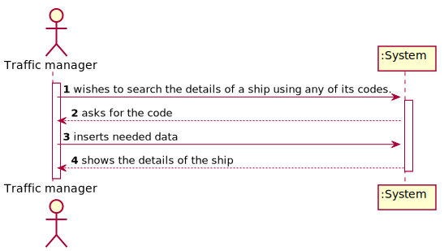
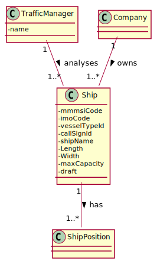
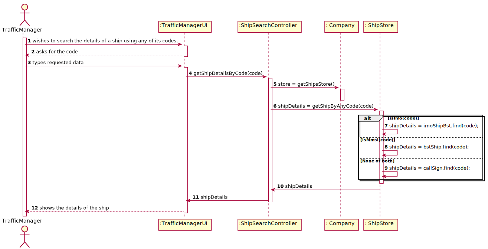
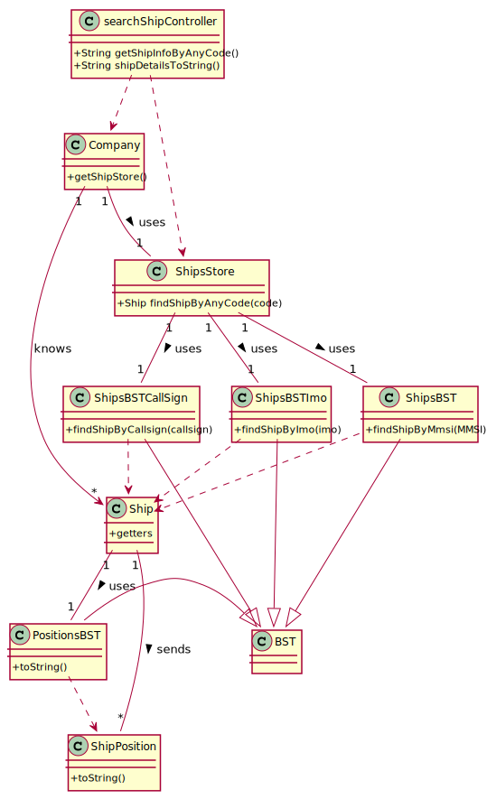

# US_102 - to search the details of a ship using any of its codes: MMSI, IMO or Call Sign

## 1. Requirements Engineering

### 1.1. User Story Description

As a **traffic manager**, I wish to search the details of a ship using **any of its codes**: MMSI, IMO or Call Sign

### 1.2. Customer Specifications and Clarifications

**From the client clarifications:**

> **Question:Should the traffic manager choose which type of code(MMSI, IMO, Call sign) to enter and then enter it or should the system automatically recognize which code is it depending on the syntax of the code??
>
> **Answer:** Humm, if it is possible, it would be better to recognise it automatically.

### 1.3. Acceptance Criteria

* **AC1:** correct use of OOP concepts

### 1.5 Input and Output Data

**Input Data:**

* Typed data:
  * code
  
**Output Data:**

* ship details
* operation success/failure

### 1.6. System Sequence Diagram (SSD)

### 1.7 Other Relevant Remarks

The present US is held many times during the business. As the traffic manager does his daily work, he will probably come across with the need to search for ship details many times.

## 2. OO Analysis

### 2.1. Relevant Domain Model Excerpt

### 2.2. Other Remarks

n/a

## 3. Design - User Story Realization

### 3.1. Rationale

**The rationale grounds on the SSD interactions and the identified input/output data.**

| Interaction ID | Question: Which class is responsible for... | Answer  | Justification (with patterns)  |
|:-------------  |:--------------------- |:------------|:---------------------------- |
| Step 1: wishes to search the details of a ship using any of its codes.|	        ... knowing the ship?  		  |ShipStore                         | IE: The shipStore object knows it's own shipsBst.        |
| Step 2: asks for the code                                   |			n/a				                          |                             |                                                      |
| Step 3: Types requested data		                          |			... knowing which shipBST to search by the code? | ShipStore                    | IE: The ships store knows it's shipsBst   |
|                             		                          |			... knowing which ship to search by the code? | ShipBST                    | IE: The ships BST knows it's ships   |
| Step 4: Returns the details of the ship                      |		n/a	          |              | |              

### Systematization ##

According to the taken rationale, the conceptual classes promoted to software classes are:

* Ship
* ShipPosition

Other software classes (i.e. Pure Fabrication) identified:
* ShipStore
* ShipBst
* ShipMovementsBst

## 3.2. Sequence Diagram (SD)

### 3.2.1 Sequence Diagram

## 3.3. Class Diagram (CD)

### 3.3.1 Class Diagram

# 4. Tests

###4.1 ShipStore class tests:
**Test 1:** Check if method getShipByAnyCode(code) chooses the right type of code depending on syntax.

**Test 2:** Check if method getShipByAnyCode(code) returns the right ship with MMSI code.

**Test 3:** Check if method getShipByAnyCode(code) returns the right ship with IMO code.

**Test 4:** Check if method getShipByAnyCode(code) returns the right ship with CallSign code.

###4.1 ShipBST classes tests:

**Test 5:** Check if search by code method is working properly.

###4.1 Ship class tests:

**Test 6:** Check if getters methods are returning the expected values.

###4.1 searchShipController class tests:

**Test 7:** Check if the integration of all methods is working properly.

