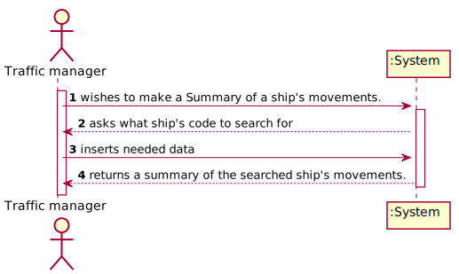

# US 104 -As a traffic manager I wish to make a Summary of a ship's movements.

## 1. Requirements Engineering

*In this section, it is suggested to capture the requirement description and specifications as provided by the client as well as any further clarification on it. It is also suggested to capture the requirements acceptance criteria and existing dependencies to other requirements. At last, identfy the involved input and output data and depicted an Actor-System interaction in order to fulfill the requirement.*

### 1.1. User Story Description

As a **traffic manager** I wish to **make a Summary of a ship's movements.**

### 1.2. Customer Specifications and Clarifications

**From the specifications document:**
>Ships are characterized by:
>- MMSI: unique 9-digit ship identification code.
>- Ship name.
>- Ship identification according to the IMO identification.
>- ...
>- Dynamic data fields relating to a ship's positioning data:
>- Base Date Time: date/time of AIS message.
>- Latitude
>- Longitude
>- Speed over ground (SOG).
>- Course over ground (COG): direction relative to absolute North (in degrees: [0; 359]).
>- Heading: ship heading (in degrees: [0; 359], 511 indicates 'not available').
>- Position: ship code in tow.
>- Transceiver Class: class to transceiver used when sending data.

**From the client clarifications:**

>Q1: How shold the ship be selected, from MMSI code, name or IMO?
>
>A2: Any of them.

### 1.3. Acceptance Criteria

* **AC1:** For a given ship return in an appropriate structure one of its codes
  (MMSI, IMO or Call Sign), Vessel Name, Start Base Date Time, End
  Base Date Time, Total Movement Time, Total Number of Movements,
  Max SOG, Mean SOG, Max COG, Mean COG, Departure Latitude,
  Departure Longitude, Arrival Latitude, Arrival Longitude, Travelled
  Distance (incremental sum of the distance between each positioning
  message) and Delta Distance (linear distance between the coordinates of
  the first and last move).

### 1.4. Found out Dependencies

There is a depencency with the craetion of a Ship object, and also with the existence of a Traffic manager role to exist be registered.

### 1.5 Input and Output Data

### 1.6 System Sequence Diagram (SSD)

### 1.7 Other Relevant Remarks

## 2. OO Analysis

### 2.1. Relevant Domain Model Excerpt
*In this section, it is suggested to present an excerpt of the domain model that is seen as relevant to fulfill this requirement.*

### 2.2. Other Remarks

n/a

## 3. Design - User Story Realization

### 3.1. Rationale

**The rationale grounds on the SSD interactions and the identified input/output data.**

| Interaction ID | Question: Which class is responsible for... | Answer  | Justification (with patterns)  |
|:-------------  |:--------------------- |:------------|:---------------------------- |
| Step 1: Asks to make a Summary of a ship's movements.        |	        ... knowing the ship's movements?		  |Ship                         | IE: The ship object knows it's own movements.        |
| Step 2: Asks what ship's code to search for                  |			n/a				                          |                             |                                                      |
| Step 3: Types requested data		                          |			... knowing which shipBST to search by the code? | ShipStore                    | IE: The ships store knows it's ships bst   |
|                             		                          |			... knowing which ship to search by the code? | ShipBST                    | IE: The ships BST knows it's ships   |
| Step 4: Returns a summary of the searched ship's movements |			...summarize the ships movements?            | ShipMovement               | IE: The shipMovements object knows it's own data to perform the neeeded calculations with it.|              

### Systematization ##

According to the taken rationale, the conceptual classes promoted to software classes are:

* Ship
* ShipMovement

Other software classes (i.e. Pure Fabrication) identified:
* ShipBST
* ShipStore
* ShipMovementsBST

## 3.2. Sequence Diagram (SD)

*In this section, it is suggested to present an UML dynamic view stating the sequence of domain related software objects' interactions that allows to fulfill the requirement.*

## 3.3. Class Diagram (CD)

*In this section, it is suggested to present an UML static view representing the main domain related software classes that are involved in fulfilling the requirement as well as and their relations, attributes and methods.*

# 4. Tests
*In this section, it is suggested to systematize how the tests were designed to allow a correct measurement of requirements fulfilling.*

**_DO NOT COPY ALL DEVELOPED TESTS HERE_**

###4.1 Ship class tests:
**Test 1:** Check if both getName and getMovements return the expected values.
### 4.2 ShipBst
**Test 2:** Check if the ship is correctly retrieved from MMSI code

### 4.3 ShipMovementsBst tests:
**Test 3** Check if the tree correctly finds the first and last node by dates:
  - **Test 3.1** Check if start and end dates are correct.
  - **Test 3.2** Check if depart latitude and longitude values are correct.
  - **Test 3.3** Check if arrival latitude and longitude values are correct.

**Test 4** Check if Max Sog and Cog values are obtained as expected.

**Test 5** Check if mean values of sog and cog are correct.

**Test 6** Check if calculations of Delta and Travel distances are correct.

### ShipPosition
**Test 7** Check if getters are returning the correct values of attributes
