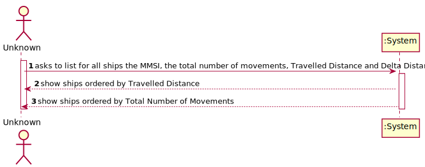
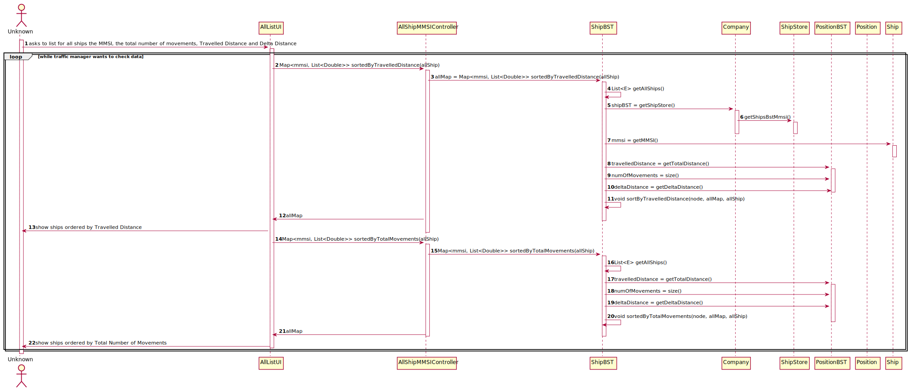
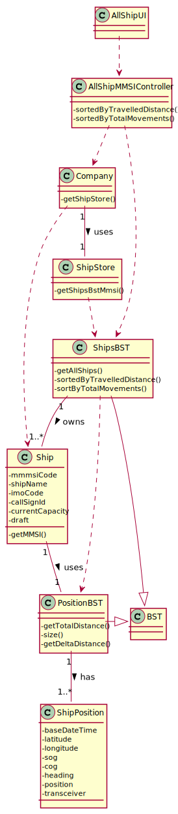

# US 105 - List for all ships the MMSI, the total number of movements, Travelled Distance and Delta Distance

## 1. Requirements Engineering

### 1.1. User Story Description

• US105: As a traffic manager I which to list for all ships the MMSI, the total number of
movements, Travelled Distance and Delta Distance.

### 1.2. Customer Specifications and Clarifications

**From the client clarifications:**

> **Question:** 
>
> **Answer:** 

### 1.3. Acceptance Criteria

* **AC1:** ordered by Travelled Distance and total number of movements
  (descending/ascending).

### 1.4. Found out Dependencies

* US101: As a traffic manager, I which to import ships from a text file into a BST.
* US102: As a traffic manager I which to search the details of a ship using any of its codes:
  MMSI, IMO or Call Sign.
* US104:  As a traffic manager I which to make a Summary of a ship's movements.

### 1.5 Input and Output Data
**Input Data:**

* All Ships in BST

**Output Data:**

* for all ships the MMSI, the total number of movements, Travelled Distance and Delta Distance ordered by Travelled Distance and total number of movements
  (descending/ascending).
* (In)Success of the operation

### 1.6. System Sequence Diagram (SSD)

### 1.7 Other Relevant Remarks

n/a

## 2. OO Analysis

### 2.1. Relevant Domain Model Excerpt

### 2.2. Other Remarks

n/a

## 3. Design - User Story Realization

### 3.1. Rationale

| Interaction ID | Question: Which class is responsible for... | Answer  | Justification (with patterns)  |
|:-------------  |:--------------------- |:------------|:---------------------------- |
| Step 1  		 |	... interacting with the actor? | TopNUI  |
| 			  	 |	... coordinating the US? | TopNController | Controller                             |
| 	Step 2		  	 |   |   |  |
|   Step 3 		 |	...saving the inputted data? | ShipStore | IE: ShipStore uses data.  | 
|  	Step 4	 |	...return list of ships?  | ShipStore| ShipStore gathers the ship's info accordingly with the initial and final Base Date Time.|

## 3.2. Sequence Diagram (SD)

## 3.3. Class Diagram (CD)

# 4. Tests

**ShipBSTTest**

     @Test
    public void getAllShipsNoDuplicates() {
        *add all ships created to a List*

        *assert using getAllShips*
    }
* Test 1: ensure all the ships in the BST are added to a List without duplicates.

    @Test
    public void mapOrderedByTravelledDistance() {
        *add ship's Travelled Distance, Delta Distance and Total Movements to different LinkedHashSets*
        *associate each Set to a Ship MMSI in a LinkedHashMap*

        *assert using sortedByTravelledDistance()*
    }
* Test 2: ensure every Ship's Travelled Distance, Delta Distance and Total Movements are associated with it's MMSI and ordered by Travelled Distance (descending)

     @Test
    public void mapOrderedByMovements() {
        *add ship's Travelled Distance, Delta Distance and Total Movements to different LinkedHashSets*
        *associate each Set to a Ship MMSI in a LinkedHashMap*

        *assert using sortedByTotalMovements()*
    }
* Test 3: ensure every Ship's Travelled Distance, Delta Distance and Total Movements are associated with it's MMSI and ordered by Total Movements (ascending)

# 5. Construction (Implementation)

## Controller

    

## UI
    

## Store

    

# 6. Integration and Demo

*
# 7. Observations

* 