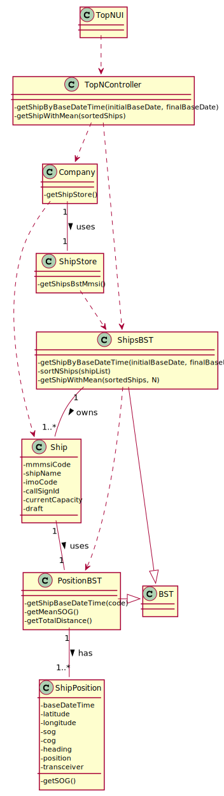

# US 106 - Top-N ships and MeanSOG

## 1. Requirements Engineering

### 1.1. User Story Description

• US16:Get the top-N ships with the most kilometres travelled and their average speed
(MeanSOG).

### 1.2. Customer Specifications and Clarifications

**From the client clarifications:**

> **Question:** "...in the US106 when it says "in a period (initial/final Base Date Time) grouped by Vessel Type", does the traffic manager specify the initial and final Date that he wants to search in?"
>
> **Answer:** "Yes."

-

> **Question:** "Regarding both US106 and US107 should we assume that these functionalities will be used by the Traffic Manager or is it for another role in the company? This detail is not present, unlike in the other User Stories."
>
> **Answer:** "
Yes, you can assume a Traffic Manager will be performing those tasks."

### 1.3. Acceptance Criteria

* **AC1:** ordered by Travelled Distance and total number of movements
  (descending/ascending).

### 1.4. Found out Dependencies

* US101: As a traffic manager, I which to import ships from a text file into a BST.
* US102: As a traffic manager I which to search the details of a ship using any of its codes:
  MMSI, IMO or Call Sign.
* US104:  As a traffic manager I which to make a Summary of a ship's movements.

### 1.5 Input and Output Data
**Input Data:**

* Initial Base Date Time;
* Final Base Date Time;
* Number of ships to get;

**Output Data:**

* Top-N ships with the most km travelled and their meanSOG
* (In)Success of the operation

### 1.6. System Sequence Diagram (SSD)

### 1.7 Other Relevant Remarks

n/a

## 2. OO Analysis

### 2.1. Relevant Domain Model Excerpt

### 2.2. Other Remarks

n/a

## 3. Design - User Story Realization

### 3.1. Rationale

| Interaction ID | Question: Which class is responsible for... | Answer  | Justification (with patterns)  |
|:-------------  |:--------------------- |:------------|:---------------------------- |
| Step 1  		 |	... interacting with the actor? | TopNUI  |
| 			  	 |	... coordinating the US? | TopNController | Controller                             |
| 	Step 2		  	 |   |   |  |
|   Step 3 		 |	...saving the inputted data? | ShipBST | IE: ShipBST uses data.  | 
|  	Step 4	 |	...return list of ships?  | ShipBST| ShipBST gathers the ship's info accordingly with the initial and final Base Date Time.|

## 3.2. Sequence Diagram (SD)

## 3.3. Class Diagram (CD)

# 4. Tests

**ShipBSTTest**

     @Test
    public void getShipsByDateCorrect() throws ParseException {
        *add N ships with different positionBST and different Base Date Time*

        *assert using getShipsByDate(initilDate. finalDate)*
    }
* Test 1: ensures all the ships that fit in the Base Date Time gap are correctly obtained and put in an ArrayList.

    @Test
    public void sortNshipsCorrect() throws ParseException {
        *add N ships to a LinkedList by order of TravelledDistance*
        
        *assert using sortNShips(List<Ship>)*
    }
* Test 2: ensures a list of Ships is ordered correctly by Travelled Distance.

     @Test
    public void getMapWithTopNAssociatedWithVesselType(){
        *create HashMap with LinkedList associated with Ship*
        *create HashMap with HashMap associated with vesselTypeId*
        
        *assert using getShipWithMean(List<Ship>, Integer topN)
    }
* Test 3: ensures every Vessel Type has Top-N Ships with the most Travelled Distance associated with it.

# 5. Construction (Implementation)

## Controller

    

## UI
   

## Store

    

# 6. Integration and Demo

*

# 7. Observations

* 
