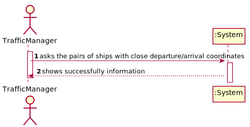
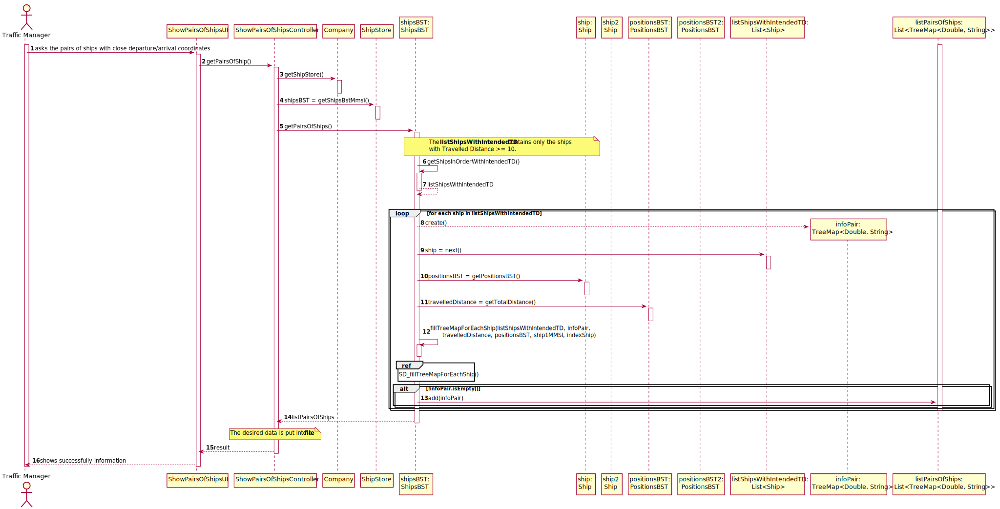

# US 107 - Show Pairs Of Ships

## 1. Requirements Engineering

### 1.1. User Story Description

As a traffic manager, I wish to have the pairs of ships with route with close departure/arrival coordinates (no more than 5 Kms away) and with different Travelled Distance.

### 1.2. Customer Specifications and Clarifications

### 1.3. Acceptance Criteria

**AC1:** Sorted by the MMSI code of the 1st ship and in descending order of the Travelled Distance difference.    
**AC2:** Do not consider ships with Travelled Distance less than 10 kms.  


### 1.4. Found out Dependencies

**US101:** Import ships from a text file into a BST  
**US104:** Summary of a Ship's Movements  

### 1.5 Input and Output Data

**Input Data:** n/a

**Output Data:**

* file containing the wished pairs of ships


### 1.6. System Sequence Diagram (SSD)




### 1.7 Other Relevant Remarks

n/a


## 2. OO Analysis

### 2.1. Relevant Domain Model Excerpt


### 2.2. Other Remarks

n/a


## 3. Design - User Story Realization 

## 3.1. Sequence Diagram (SD)

  

### 3.1.1 Partial Sequence Diagram  


## 3.3. Class Diagram (CD)


# 4. Tests 

### ShipsBST Class  

**Test 1:** Test to ensure getShipsInOrderWithIntendedTD works correctly.  
Steps:  
* an expected List<Ship> should be created  
* the list should be filled with Ship objects in the intended order  
* obtain the actual list through calling the method getShipsInOrderWithIntendedTD()  
* result: the lists are equal  

```
@Test
    void getShipsInOrderWithIntendedTD() {
    }
```

**Test 2:** Test to ensure fillTreeMapEachShip() works correctly.  
Steps:  
* create or get a List<Ship> containing a list of Ship objects  
* create an expected descending TreeMap using Collections.reverseOrder()  
* create the actual descending TreeMap using Collections.reverseOrder()
* obtain the first Ship object of the List<Ship> created  
* obtain the index of that Ship  
* obtain the PositionsBST of that Ship  
* obtain the Travelled Distance of that Ship  
* fill the actual TreeMap using the method fillTreeMapForEachShip using the objects and info obtained  
* result: the list should be equal or if empty, their sizes should be equal  

```
@Test
    void fillTreeMapForEachShip() {
    }
```  

**Test 3:** Test to ensure getPairsOfShips() works correctly.  
Steps:  
* create an expected List<TreeMap<Double, String>> containing the expected result if the result is not empty  
* create the actual through calling the method getPairsOfShips  
* result: the lists should be equal or its sizes, if the result is empty  

```
@Test
    void getPairsOfShips() {
    }
```  

OBSERVATION: To facilitate testing this method, we can import information in a .csv file using Controller available from US101.

### PositionsBST Class 

**Test 1:** Test to ensure getArrivalDistance(positionsBST2) works properly.  
Steps:
* create a double with the expected result  
* create 2 Ship objects with Ship Positions  
* obtain the actual result through calling the method  
* result: the results are equal  

```
public Double getArrivalDistance(positionsBST2) {
}
```

**Test 2:** Test to ensure getDepartureDistance(positionsBST2) works properly.
Steps: see steps from the previous test and use the same logic  

```
public Double getDepartureDistance(positionsBST2) {
}
```
