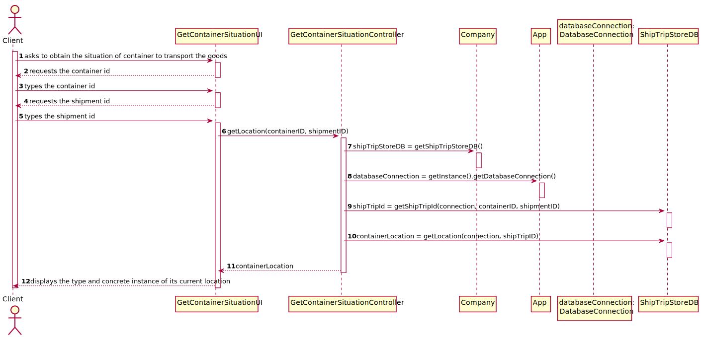
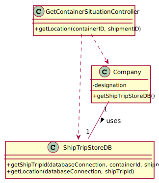

# US 104 - Get Container Situation

## 1. Requirements Engineering

### 1.1. User Story Description

As Client, I want to know the current situation of a specific container being used to transport my goods.

### 1.2. Acceptance Criteria

* Clients provide the container identifier and get the type and the concrete
  instance of its current location, e.g., PORT, Leixões or SHIP, WeFly.

### 1.5 Input and Output Data

**Input Data:**

* Typed data:
    * Container ID
    * Shipment ID

* Selected data:
    * n/a


**Output Data:**

* type and concrete instance of container location


### 1.6. System Sequence Diagram (SSD)


### 1.7 Other Relevant Remarks

n/a


## 2. OO Analysis

### 2.1. Relevant Domain Model Excerpt


### 2.2. Other Remarks

n/a


## 3. Design - User Story Realization

## 3.1. Sequence Diagram (SD)



## 3.2. Class Diagram (CD)



# 4. Tests

For the tests, it is needed to instanciate a Datebaseconnection object and Callable Statement to connect with Data Base.

### ShipTripStoreDB class

**Test 1:** Test to ensure getShipTripID() is functioning correctly.
```
@Test
    public void getShipTripID() {
    }
```

**Test 2:** Test to ensure getLocation() is functioning correctly.
```
@Test
    public void getLocation() {
    }
```

### GetContainerSituationController Class

**Test 3:** Test to ensure getLocation() is functioning properly
```
@Test
    public void getLocation(containerID, shipmentID) {
    }
```
