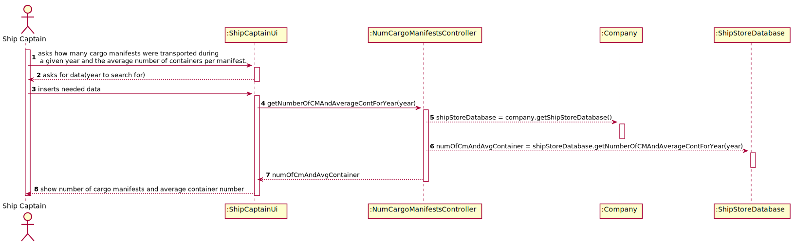

# US 207 -As Ship Captain, I want to know how many cargo manifests I have transported during a given year and the average number of containers per manifest.

## 1. Requirements Engineering

*In this section, it is suggested to capture the requirement description and specifications as provided by the client as well as any further clarification on it. It is also suggested to capture the requirements acceptance criteria and existing dependencies to other requirements. At last, identfy the involved input and output data and depicted an Actor-System interaction in order to fulfill the requirement.*

### 1.1. User Story Description

As **Ship Captain**, I want to know how many **cargo manifests** I have transported during a given year and the **average number of containers** per manifest.

### 1.2. Customer Specifications and Clarifications

**From the specifications document:**

>The system is to be used by the following people:
> 
> ...
> 
> Ship captain – someone who oversees ship operations

>Each time a ship docks at a port or a truck arrives at a location, an Unloading Cargo Manifest is
delivered to the operations team at the port or warehouse and at the end of operations a Loading
Cargo Manifest is delivered to the ship crew. The same is true for trucks. The Cargo Manifest only has
the necessary information about the containers that are being loaded and unloaded.

**From the client clarifications:**

>Q1: How shold the ship be selected, from MMSI code, name or IMO?
>
>A2: Any of them.

### 1.3. Acceptance Criteria

* **AC1:** Only the cargo manifests of the specified year are considered.
* **AC2:** Average containers per cargo manifest are properly computed.

### 1.4. Found out Dependencies

There is a dependency with the existence of the cargo manifest and container classes, and also with US111: "As Project Manager, I want the team to create a SQL script to load the database
with a minimum set of data sufficient to carry out data integrity verification and functional testing".

### 1.5 Input and Output Data

**Input data:**
The year to search for cargo manifests.

### 1.6 System Sequence Diagram (SSD)

### 1.7 Other Relevant Remarks

## 2. OO Analysis

### 2.1. Relevant Domain Model Excerpt
*In this section, it is suggested to present an excerpt of the domain model that is seen as relevant to fulfill this requirement.*

### 2.2. Other Remarks

n/a

## 3. Design - User Story Realization

### 3.1. Rationale

**The rationale grounds on the SSD interactions and the identified input/output data.**

| Interaction ID                                                                                                                | Question: Which class is responsible for...                                 | Answer               | Justification (with patterns)                                                                                                       |
|:------------------------------------------------------------------------------------------------------------------------------|:----------------------------------------------------------------------------|:---------------------|:------------------------------------------------------------------------------------------------------------------------------------|
| Step 1: asks how many cargo manifests were transported during a given year and the average number of containers per manifest. | 	        n/a	                                                               |                      |                                                                                                                                     |
| Step 2: Asks what ship's code to search for                                                                                   | 			n/a				                                                                  |                      |                                                                                                                                     |
| Step 3: Types requested data		                                                                                                | 			...knowing which ship to search for                                      | App                  | Pure fabrication: The Ship Captain is assigned to a ship registered in the database retrieved from the App controller               |
| 		                                                                                                                            | 			... knowing how many cargo manifests a ship transported in a given year? | ShipStoreDatabase    | IE: The shipstoredatabase is responsible for consulting the database and therefore knows all the cargo manifests                    |
| 		                                                                                                                            | 			... knowing the average number of containers per manifest                | ShipStoreDatabase | IE: The shipstoredatabase  is responsible for consulting the database and therefore knows all the containers in cargo manifest |
| Step 4: Shows number of cargo manifests and average container number                                                          | 			n/a                                                                      | n/a         | n/a                                       |              

### Systematization ##

According to the taken rationale, the conceptual classes promoted to software classes are:

* Ship
* CargoManifest
* Container

Other software classes (i.e. Pure Fabrication) identified:
* ShipStoreDatabase
* App

## 3.2. Sequence Diagram (SD)

*In this section, it is suggested to present an UML dynamic view stating the sequence of domain related software objects' interactions that allows to fulfill the requirement.*

## 3.3. Class Diagram (CD)

*In this section, it is suggested to present an UML static view representing the main domain related software classes that are involved in fulfilling the requirement as well as and their relations, attributes and methods.*

# 4. Tests
*In this section, it is suggested to systematize how the tests were designed to allow a correct measurement of requirements fulfilling.*

###4.1 Controller class tests:
**Test 1:** Check if the integration of the functionality works as expected

