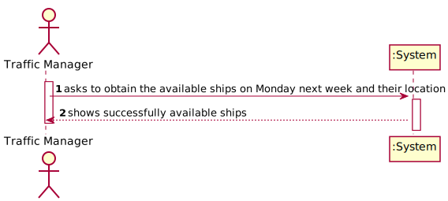
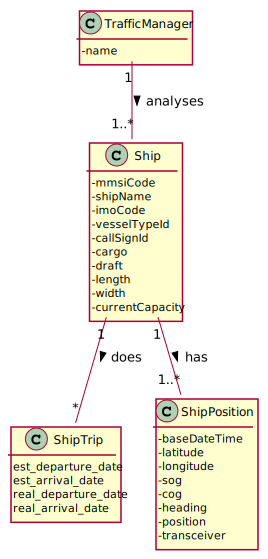

# US 104 - Get Available Ships on Monday Next Week

## 1. Requirements Engineering

### 1.1. User Story Description

As Traffic manager, I need to know which ships will be available on Monday next week and their location.

### 1.2. Acceptance Criteria

* Monday next week is properly identified.  
* Only available ships are returned.  
* All available ships are returned.  

### 1.5 Input and Output Data

**Input Data:**

* Typed data:
    * n/a

* Selected data:
    * n/a

**Output Data:**

* available ships next monday next week

### 1.6. System Sequence Diagram (SSD)

### 1.7 Other Relevant Remarks

n/a

## 2. OO Analysis

### 2.1. Relevant Domain Model Excerpt

### 2.2. Other Remarks

n/a

## 3. Design - User Story Realization

## 3.1. Sequence Diagram (SD)

## 3.2. Class Diagram (CD)

# 4. Tests

For the tests, it is needed to instanciate a Datebaseconnection object and Callable Statement to connect with Data Base.

### ShipTripStoreDB class

**Test 1:** Test to ensure getNextMondayAvailableShips() is functioning correctly.

### FindAvailableShipsController Class

**Test 3:** Test to ensure getNextMondayAvailableShips() is functioning properly
