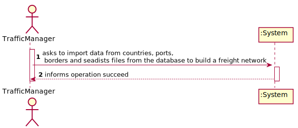
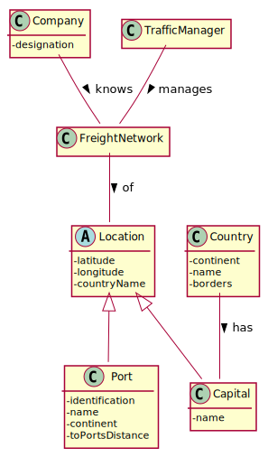
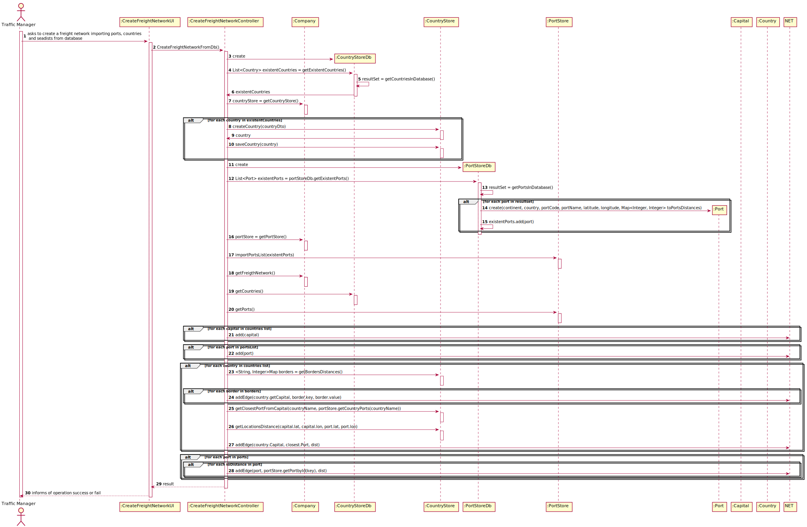
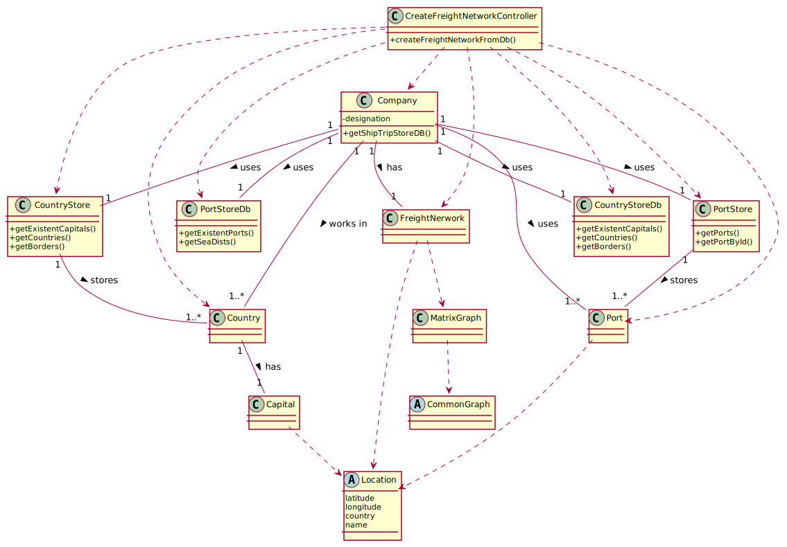

# US 301 - As a Traffic manager, I which to import data from countries, ports, borders and seadists files from the database to build a freight network.

## 1. Requirements Engineering

### 1.1. User Story Description

As a Traffic manager, I which to import data from countries, ports, borders and seadists files from the database to build a freight network.

### 1.2. Acceptance Criteria

**AC1**: The capital of a country has a direct connection with the capitals of the
countries with which it borders. 

**AC1.1**: The ports of a country, besides connecting with all the ports of the same country, the port closest to the
capital of the country connects with it; 

**AC1.2**: Each port of a country connects with the n closest ports of any other country

**AC2**:The calculation of distances in Kms between capitals, and ports and
capitals must be done using the GPS coordinates.

**AC3**: The graph must be implemented using the adjacency matrix
representation and ensuring the indistinct manipulation of capitals and
seaports.

### 1.5 Input and Output Data

**Input Data:**

* Typed data:
  * n/a
* Selected data:
  * n/a
  
**Output Data:**
* succes or failure message
### 1.6. System Sequence Diagram (SSD)

### 1.7 Other Relevant Remarks

n/a

## 2. OO Analysis

### 2.1. Relevant Domain Model Excerpt

### 2.2. Other Remarks

n/a

## 3. Design - User Story Realization

## 3.1. Sequence Diagram (SD)

## 3.2. Class Diagram (CD)

# 4. Tests

For the tests, it is needed to instanciate a Datebaseconnection object and Callable Statement to connect with Data Base.

### CountryStore class

**Test 1:** Ensure Capitals and borders are retrieved correctly.

**Test 2:** Ensure closest port from capital is correct.

### PortStore class

**Test 3:** Ensure Ports and seadists are retrieved correctly.

**Test 4:** Ensure Ports of a given country are retrieved correctly.

### DistanceUtils

**Test 5:** Check if distances are calculated correctlly.

### Controller

**Test 6:** Check if the edges are being estabilished correctly.
