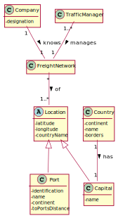

# US 302 - Color Map

## 1. Requirements Engineering

### 1.1. User Story Description

As a Traffic manager I wish to colour the map using as few colours as possible.

### 1.2. Acceptance Criteria

* Neighbouring countries must not share the same colour

### 1.4. Found out Dependencies

* US301: Import data from countries, ports, borders and seadists files from the database to build a freight network.

### 1.5 Input and Output Data

**Input Data:**

* Typed data:
    * n/a

* Selected data:
    * n/a

**Output Data:**

* a Map containing each Capital with its respective color

### 1.6. System Sequence Diagram (SSD)

### 1.7 Other Relevant Remarks

n/a

## 2. OO Analysis

### 2.1. Relevant Domain Model Excerpt

### 2.2. Other Remarks

n/a

## 3. Design - User Story Realization

## 3.1. Sequence Diagram (SD)

## 3.2. Class Diagram (CD)

# 4. Tests

### FreightNetwork class

**Test 1:** Test to ensure getOrderedCapitalsList() is functioning correctly.

- an expected list with all the capitals and its colors
- the list through calling the method 
- checks whether the lists are equal

**Test 2:** Test to ensure getCapitalsToColor() is functioning correctly.

- an expected map with all the capitals and colors set to null
- the map through calling the method
- checks whether the maps are equal

**Test 3:** Test to ensure colorMap() is functioning properly

Situation 1: 
- an expected map with all the capitals and colors
- the map through calling the method
- checks whether the maps are equal

Situation 2:
- the expected minimum colors to be used
- obtain the minimum colors actually used
- checks whether the number of colors are equal

Situation 3: (**for each capital**)
- through the map containing the capitals and colors, obtain the **submap** containing **only** the neighbouring countries of the capital to be tested
- obtain the color of the capital to be tested
- check if the subMap does **not** contain the color of the capital to be tested, meaning **none of the neighbouring countries of the country being tested have the same color of it**

### ColorMapController class

**Test 1:** Test to ensure colorMap() is functioning correctly.

- an expected map with all the capitals and colors set to null
- the map through calling the method
- checks whether the maps are equal

