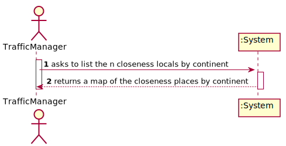
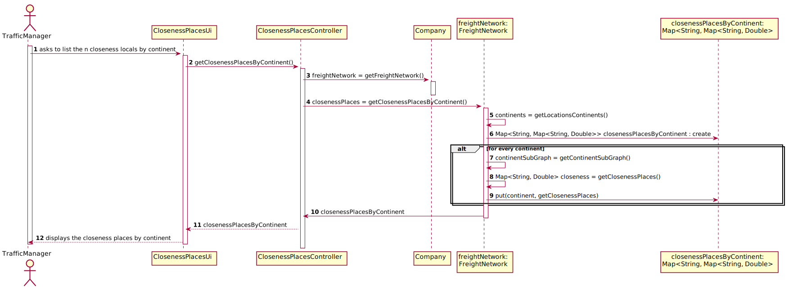
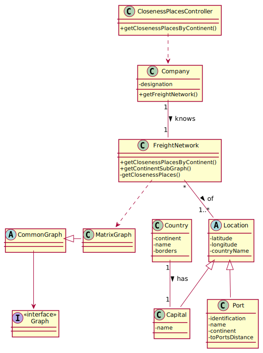

# US 303 - Get closeness locals by continent

## 1. Requirements Engineering

### 1.1. User Story Description

As a Traffic manager I wish to know which places (cities or ports) are closest to all other places (closeness places).

### 1.2. Acceptance Criteria

* Return the n closeness locals by continent
* The measure of proximity is calculated as the average of the shortest path
  length from the local to all other locals in the network

**From the client clarifications:**

>Q1: In US303 we should return the n closest locals by continent, but should we calculate the closest locals by comparing them with locals from all over the world or just from their respective continent?
>
>A2: Should only consider the locations of the continent.
> 
> [Link](https://moodle.isep.ipp.pt/mod/forum/discuss.php?d=12650)

### 1.4. Found out Dependencies

* US301: Import data from countries, ports, borders and seadists files from the database to build a freight network.

### 1.5 Input and Output Data

**Input Data:**

* Typed data:
    * n/a

* Selected data:
    * n/a

**Output Data:**

* An Map<String, Map<String, Double>> with each continent closeness locals and it's indices.

### 1.6. System Sequence Diagram (SSD)

### 1.7 Other Relevant Remarks

n/a

## 2. OO Analysis

### 2.1. Relevant Domain Model Excerpt

### 2.2. Other Remarks

n/a

## 3. Design - User Story Realization

## 3.1. Sequence Diagram (SD)

## 3.2. Class Diagram (CD)

# 4. Tests

### FreightNetwork class

**Test 1** Check if existent continents of a locations freight network are obtained correctly.

**Test 2** Check if subgraph of a continent is obtained correctly.

**Test 3** Check if values of closeness are correct.

**Test 4** Check if closeness sort order is correct by continent

