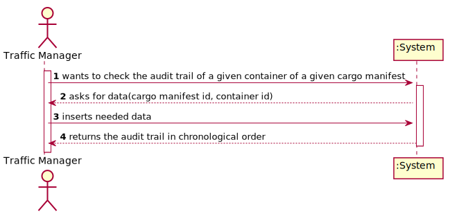
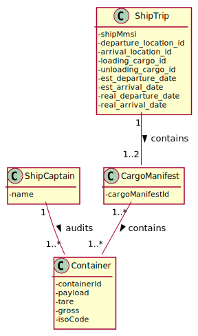
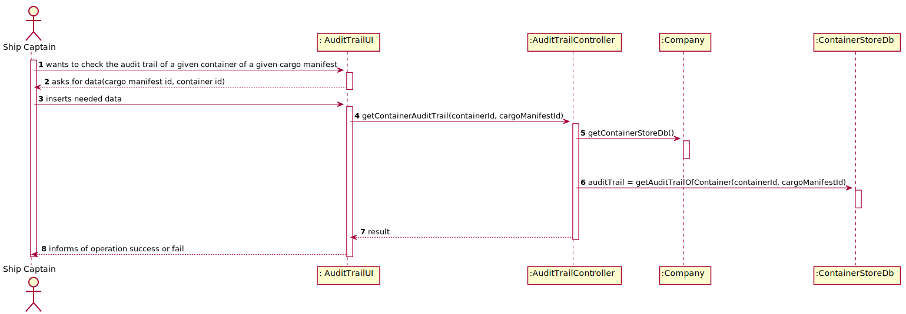
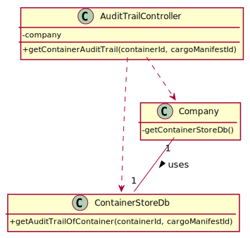

# RELATORY

# US 304 - As Ship Captain, I want to have access to audit trails for a given container of a given cargo manifest

## 1. Requirements Engineering

### 1.1. User Story Description

As Ship Captain, I want to have access to audit trails for a given container of a given cargo manifest
### 1.2. Acceptance Criteria

* There is a table for recording audit trails, i.e., record all write-operations
  involving containers of a cargo manifest.
* Proper mechanisms for recording write-operations involving containers
  of a cargo manifest are implemented (INSERT, UPDATE, DELETE).
* A simple and effective audit trail consultation process is implemented.

### 1.3. Found out Dependencies

Dependencies with the existence of cargo manifests and a given container loadaded in the database.

### 1.4 Input and Output Data

**Input Data:**

* Typed data:
  * Cargo manifest id
  * Container id
* Selected data:
    * n/a

**Output Data:**

* The audit trail for a given container of a given cargo manifest.

### 1.5. System Sequence Diagram (SSD)

## 2. OO Analysis

### 2.1. Relevant Domain Model Excerpt

### 2.2. Other Remarks

n/a

## 3. Design - User Story Realization

## 3.1. Sequence Diagram (SD)

## 3.2. Class Diagram (CD)

# 4. Tests

### AuditTrailController

**Test 1**: Check if the audit trail is gotten correclty.

**Test 2**: Check if there is no record for a given container of a cargo manifest it returns the correct message.

