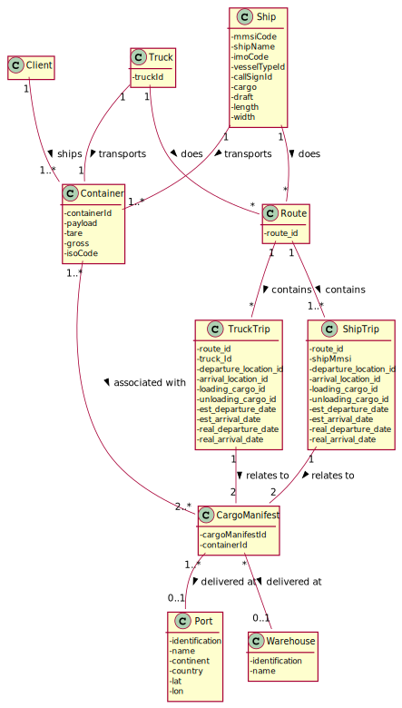
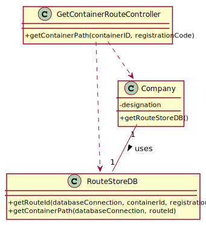

# US 305 - Route of Container

## 1. Requirements Engineering

### 1.1. User Story Description

As Client, I want to know the route of a specific container I am leasing.

### 1.2. Acceptance Criteria

* Users provide their registration code, the container identifier and get its
  path, from source to current location indicating time of arrival and
  departure at each location and mean of transport (ship or truck) between
  each pair of locations.
* When the provided identifier is not valid or, being valid, is not leased by
  the client, a warning is returned.

### 1.4. Found out Dependencies

n/a

### 1.5 Input and Output Data

**Input Data:**

* Typed data:
    * registration code
    * container id

* Selected data:
    * n/a

**Output Data:**

* route of the container until its current location

### 1.6. System Sequence Diagram (SSD)

### 1.7 Other Relevant Remarks

n/a

## 2. OO Analysis

### 2.1. Relevant Domain Model Excerpt

### 2.2. Other Remarks

n/a

## 3. Design - User Story Realization

## 3.1. Sequence Diagram (SD)

## 3.2. Class Diagram (CD)

# 4. Tests

Tests to ensure getRoudeID() is functioning correctly.

**Test 1:** Check if it raises exception ex_invalid_container_id correctly

**Test 2:** Check if it raises exception ex_not_leased_client

**Test 3:** Check if it returns the route it correctly when there isn't any invalid data

Tests to ensure get_path_function() is functioning correctly.

**Test 1:** Test for: the container is at the a location

**Test 2:** Test for: the container is in the middle of the ocean

**Test 3:** Test for: the container is in a truck

**Test 4:** Test for: the container has arrived its destination

