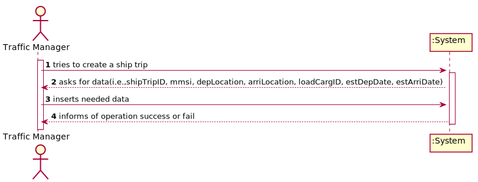
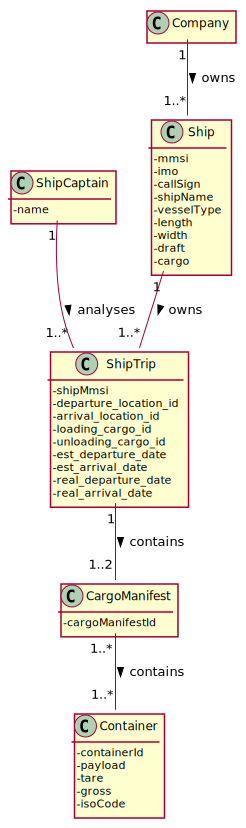
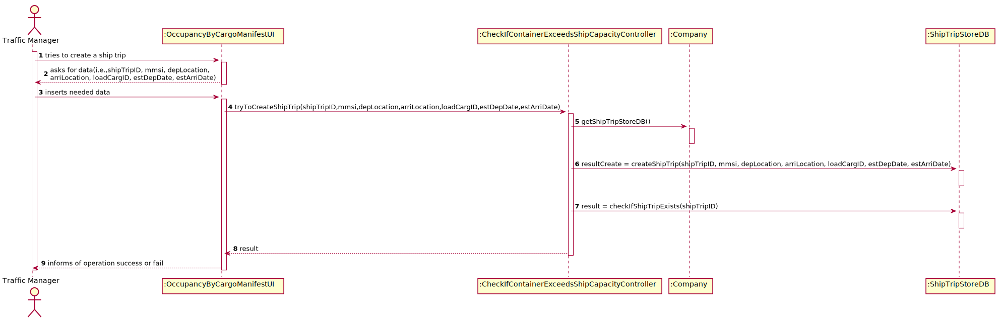
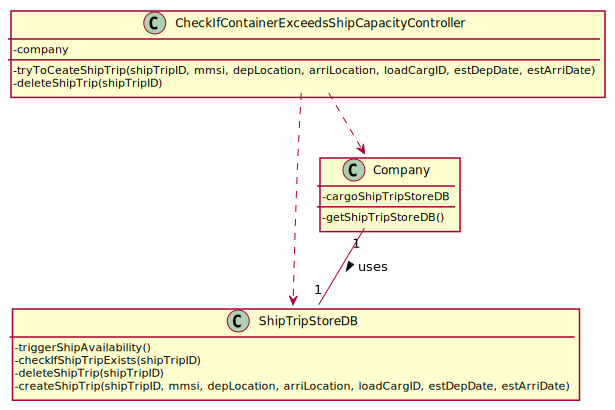

# US 309 -As Traffic manager, I do not allow a cargo manifest for a particular trip to be registered in the system on a date when the ship is already in transit.

## 1. Requirements Engineering

### 1.1. User Story Description

As Traffic manager, I do not allow a cargo manifest for a particular trip to be registered in the system on a date when the ship is already in transit.

### 1.2. Acceptance Criteria

* The ship is properly identified.
* Ship’s availability is properly computed.
* A warning or an exception is triggered when required.

### 1.4. Found out Dependencies

n/a

### 1.5 Input and Output Data

**Input Data:**

* Typed data:
    * the ship
    * the cargo manifest

* Selected data:
    * n/a

**Output Data:**
 n/a

### 1.6. System Sequence Diagram (SSD)

### 1.7 Other Relevant Remarks

n/a

## 2. OO Analysis

### 2.1. Relevant Domain Model Excerpt

### 2.2. Other Remarks

n/a

## 3. Design - User Story Realization

## 3.1. Sequence Diagram (SD)

## 3.2. Class Diagram (CD)

# 4. Tests

### CheckIfContainerExceedsShipCapacityController

**Test 1**: Check if the trigger exception is activated when trying to insert a cargo manifest for an occupied ship.

