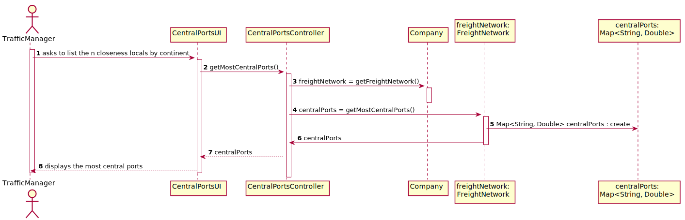

# US401 As a Traffic manager I wish to know which ports are more critical (have greater centrality) in this freight network.

## 1. Requirements Engineering

### 1.1. User Story Description

As a Traffic manager I wish to know which ports are more critical (have greater centrality) in this freight network.

### 1.2. Acceptance Criteria

* Return the n ports with greater centrality.
* The centrality of a port is defined by the number of shortest paths that
  pass through it

**From the client clarifications:**

>Q1: 
>
>A1:
> 
> [Link](https://moodle.isep.ipp.pt/mod/forum/discuss.php?d=12650)

### 1.4. Found out Dependencies

* US301: Import data from countries, ports, borders and seadists files from the database to build a freight network.

### 1.5 Input and Output Data

**Input Data:**

* Typed data:
    * n/a

* Selected data:
    * n/a

**Output Data:**

* A Map<String, Double> with the most central ports and it's nodes and it's indices.

### 1.6. System Sequence Diagram (SSD)

### 1.7 Other Relevant Remarks

n/a

## 2. OO Analysis

### 2.1. Relevant Domain Model Excerpt

### 2.2. Other Remarks

n/a

## 3. Design - User Story Realization

## 3.1. Sequence Diagram (SD)

## 3.2. Class Diagram (CD)

# 4. Tests

### FreightNetwork class

