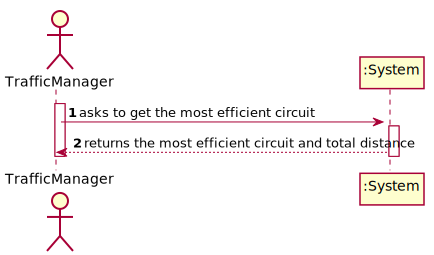

# RELATORY

# US 403 - Most efficient circuit that passes through the most locations

## 1. Requirements Engineering

### 1.1. User Story Description

As a Traffic manager I wish to know the most efficient circuit that starts from a source location and visits the greatest number of other locations once, returning to the starting location and with the shortest total distance.

### 1.2. Acceptance Criteria

* Implement one of the heuristics used for this type of circuit.

### 1.3. Found out Dependencies

* N/A

### 1.4 Input and Output Data

**Input Data:**

* Typed data:
    * n/a

* Selected data:
    * n/a

**Output Data:**

* Circuit with the most efficient circuit and the respective distance.

### 1.5. System Sequence Diagram (SSD)

### 1.6 Other Relevant Remarks

The present US is held many times during the business. As the Traffic Manager manages the traffic and routes, he will need to know how the coordinates of the locations and respective distances from on another.

## 2. OO Analysis

### 2.1. Relevant Domain Model Excerpt

### 2.2. Other Remarks

n/a

## 3. Design - User Story Realization

## 3.1. Sequence Diagram (SD)

## 3.2. Class Diagram (CD)

# 4. Tests

### MostEfficientCircuitController class test:

**Test 1:** Test to check that the Map returned by the Controller is correct, with the biggest circuit and its corresponding weight