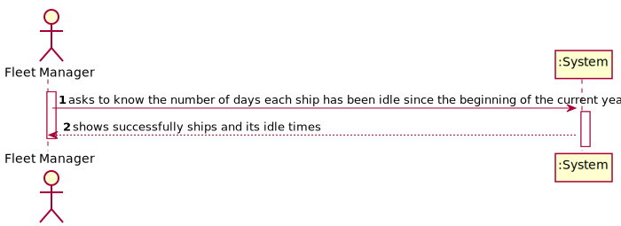
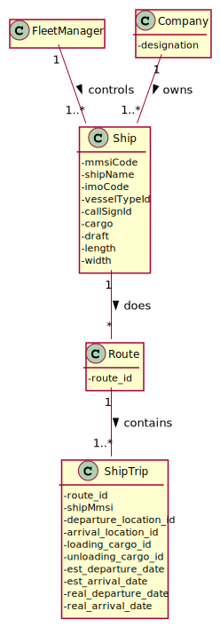
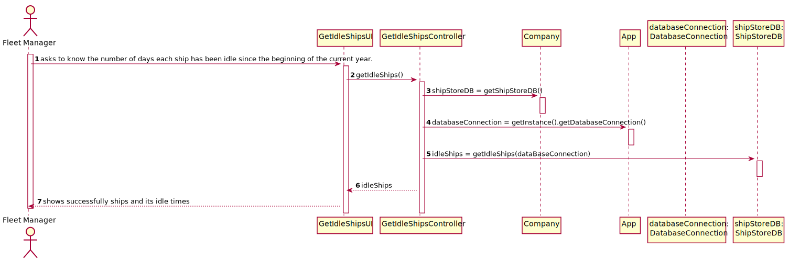
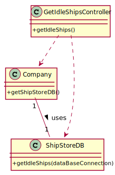

# US 404 - Number of days each ship has been idle since the beginning of the current year

## 1. Requirements Engineering

### 1.1. User Story Description

As Fleet Manager, I want to know the number of days each ship has been idle
since the beginning of the current year.

### 1.2. Acceptance Criteria

* Current year is properly identified.  
* Idle time is correctly computed per ship.  
* Ships with no idle time are also reported.

### 1.5 Input and Output Data

**Input Data:**

* Typed data:
    * n/a

* Selected data:
    * n/a

**Output Data:**

* ships and the number of days each ship has been idle since the beginning of the year

### 1.6. System Sequence Diagram (SSD)

### 1.7 Other Relevant Remarks

n/a

## 2. OO Analysis

### 2.1. Relevant Domain Model Excerpt

### 2.2. Other Remarks

n/a

## 3. Design - User Story Realization

## 3.1. Sequence Diagram (SD)

## 3.2. Class Diagram (CD)

# 4. Tests

### ShipStoreDB

Tests to ensure getIdleShips() is functioning correctly.

**Test 1:** Check if beginning of the year is correctly computed in the method

**Test 2:** Check if it returns the ships and their idle days correctly

Similar logic must be applied to getIdleShipes() in GetIdleShipsController Class.