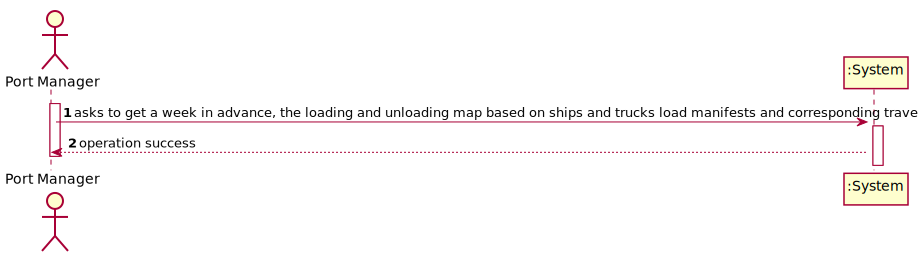

# US 407 - the loading and unloading map based on ships and trucks load manifests and corresponding travel plans a week in advance

## 1. Requirements Engineering

### 1.1. User Story Description

As Port manager, I intend to generate, a week in advance, the loading and
unloading map based on ships and trucks load manifests and corresponding travel plans,
to anticipate the level of sufficient and necessary resources (loading and unloading staff,
warehouse staff, ...).

### 1.2. Acceptance Criteria

* Week in advance is properly identified.
* Loading and unloading map is comprehensive.
* Loading and unloading map is clear with respect to the sufficient and
  necessary resources for loading and unloading tasks.

### 1.5 Input and Output Data

**Input Data:**

* Typed data:
    * n/a

* Selected data:
    * n/a

**Output Data:**

* type and concrete instance of container location

### 1.6. System Sequence Diagram (SSD)

### 1.7 Other Relevant Remarks

n/a

## 2. OO Analysis

### 2.1. Relevant Domain Model Excerpt

### 2.2. Other Remarks

n/a

## 3. Design - User Story Realization

## 3.1. Sequence Diagram (SD)

## 3.2. Class Diagram (CD)

# 4. Tests

**Test 1:** Check if next week is correctly computed in the method

**Test 2:** Check if it returns the proper information correctly

Similar logic must be applied to getUnloadingLoadingMap() in Controller Class.
