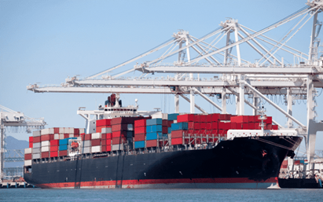
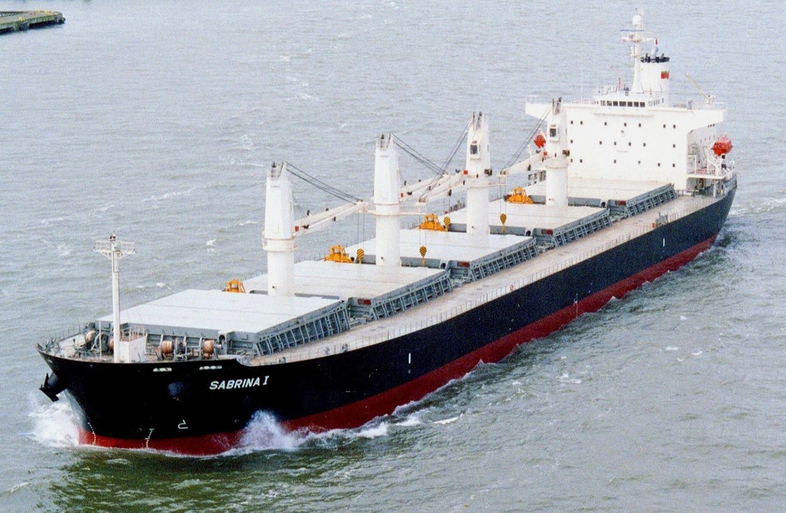
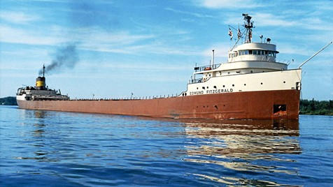
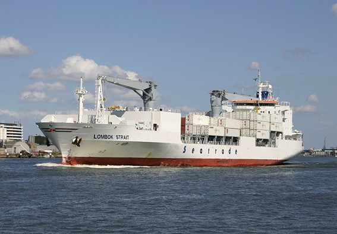

# US 417 - three types of ship/vessels

## 1. Requirements Engineering

### 1.1. User Story Description

As the Ship Captain I want the technical team to search for at least three types of
ship/vessels that are better suited to the task (e.g., depending on the type of cargo), in
which the “control” bridge can assume three positions, one in the bow, one in the stern,
and finally in the midship.

### 1.2. Acceptance Criteria

* Search the different types of vessels for transporting different types of
  cargo. Containers, or solids in bulk.
* Identify the differentiating characteristics.

### 1.3 Types Of Vessels

### 1.3.1 Container Ship

A container ship is a vessel structured specifically to hold huge quantities of cargo compacted in different types of containers.  
A container can be transferred between truck, train and ship relatively easily and is a standard size to simplify transportation.  
Containers can accommodate anything from foodstuffs to electrical equipment to automobiles. They are also used to transport bagged and palletised goods, as well as liquids and refrigerated cargo.  

This type of ship usually has the control bridge in the midship.

### 1.3.2 Bulk Carrier Ship

Bulk carriers are a type of ship which transports cargo (generally dry cargo) in bulk quantities.  
The cargo transported in such ships is loose cargo, i.e. without any specific packaging and generally contains items like food grains, ores and coals and even cement.   

This type of ship usually has the control bridge in the stern.  

### 1.3.2.1 Lake Freighter  

Lake freighters, or lakers, are bulk carrier vessels that ply the Great Lakes of North America.  

Unlike ocean freighters, lake freighters usually have the “control” bridge in the bow (as opposed to in the stern).  

### 1.3.3 Reefer Vessel  

Reefer Vessels are ships designed to carry a refrigerated cargo usually comprising perishable goods such as fruit or meat.  
Cargo is stowed in holds which are then sealed and temperature controlled.  
Nowadays, traditional reefer vessels have been largely replaced by the use of reefer containers which may be carried on board a container vessel.  

This type of ship usually has the control bridge in the stern.  

### 1.4 Differentiating characteristics  

There are many different varieties of ships and the differences are mostly based upon the type of cargo the ship transports.
The main differentiating characteristics are highlighted in the following bullet points:  

* Each ship is designed to transport a different type of cargo  
* Each ship have a different control bridge position from each other   
* Container Ships can carry a wide variety of containers, including reefer containers, which justify why Reefer Vessel has been largely replaced by this type of ship.  
  * The other mentioned types of ships are more limited in the type of cargo and containers they can carry.

### 1.4.1 Unique Characteristics of Bulk Carrier Ships  

* The absence of containers on deck is a decisive indicator that a vessel is a dry-bulk ship.  
* An incontrovertible indicator is the self-unloading gear, usually a large horizontal boom of open trusswork, carried by some bulk ships.

