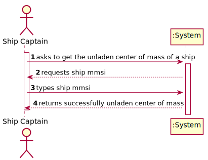
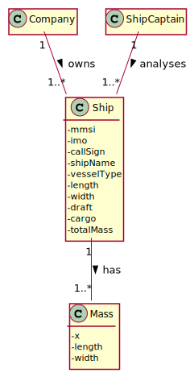
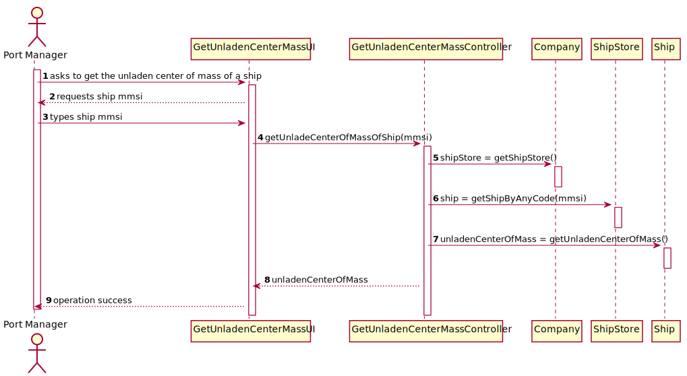
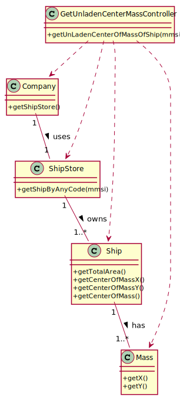

# US 418 - determine the unladen center of mass for each vessel

## 1. Requirements Engineering

### 1.1. User Story Description

As the Ship Captain I want the determine the unladen center of mass for each
vessel (if different) according to its characteristics. For calculation purposes, consider
known geometric figures.

### 1.2. Acceptance Criteria

* Make a sketch of the vessel's geometric figure
* Identify/choose a reference for the calculation.
* Determine the center of mass for the different vessels (consider that the
  vessel is all made of the same material).

### 1.5 Input and Output Data

**Input Data:**

* Typed data:
    * ship

* Selected data:
    * n/a

**Output Data:**

* unladen center of mass

### 1.6. System Sequence Diagram (SSD)

### 1.7 Other Relevant Remarks

n/a

## 2. OO Analysis

### 2.1. Relevant Domain Model Excerpt

### 2.2. Other Remarks

n/a

## 3. Design - User Story Realization

## 3.1. Sequence Diagram (SD)

## 3.2. Class Diagram (CD)

