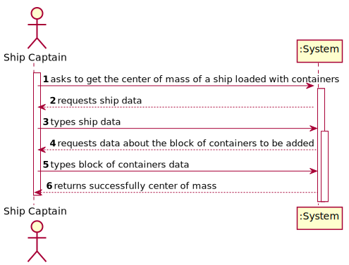
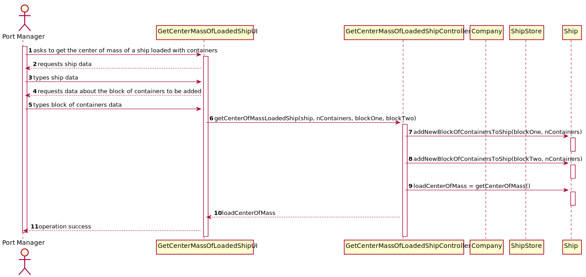
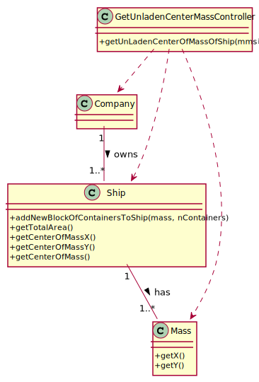

# US 419 -  position, for example, one hundred (100) containers on the vessel, such that the center of mass remains at xx and yy

## 1. Requirements Engineering

### 1.1. User Story Description

As the Ship Captain I want to know where to position, for example, one hundred
(100) containers on the vessel, such that the center of mass remains at xx and yy,
determined in the previous point.

### 1.2. Acceptance Criteria

* Identify the area/volume of a container and its center of mass. The
distribution of the mass inside the container will be considered uniform.  
* Make a sketch of the distribution and loading on the vessel.  
* Calculate the center of mass of the sketch performed.

### 1.5 Input and Output Data

**Input Data:**

* Typed data:
    * ship
    * nContainers
    * blockOne
    * blockTwo

* Selected data:
    * n/a

**Output Data:**

* center of mass

### 1.6. System Sequence Diagram (SSD)

### 1.7 Other Relevant Remarks

n/a

## 2. OO Analysis

### 2.1. Relevant Domain Model Excerpt

### 2.2. Other Remarks

n/a

## 3. Design - User Story Realization

## 3.1. Sequence Diagram (SD)

## 3.2. Class Diagram (CD)

