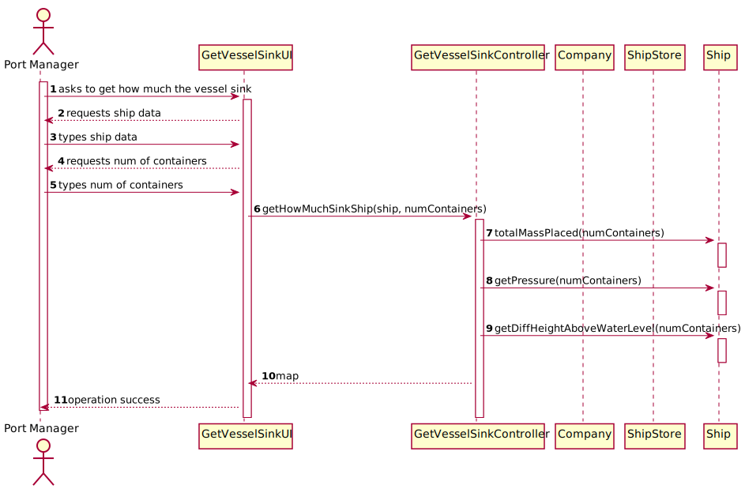

# US 419 -  how much did the vessel sink

## 1. Requirements Engineering

### 1.1. User Story Description

As the Ship Captain I want to know where to position, for example, one hundred
(100) containers on the vessel, such that the center of mass remains at xx and yy,
determined in the previous point.

### 1.2. Acceptance Criteria

* Determine the total mass placed on the vessel and the pressure exerted
  by it on the water. 
* Determine the difference in height that the vessel has suffered, above
  water level.

### 1.5 Input and Output Data

**Input Data:**

* Typed data:
    * ship
    * nContainers

* Selected data:
    * n/a

**Output Data:**

* total mass placed, pressure, difference in height

### 1.6. System Sequence Diagram (SSD)

### 1.7 Other Relevant Remarks

n/a

## 2. OO Analysis

### 2.1. Relevant Domain Model Excerpt

### 2.2. Other Remarks

n/a

## 3. Design - User Story Realization

## 3.1. Sequence Diagram (SD)

## 3.2. Class Diagram (CD)

